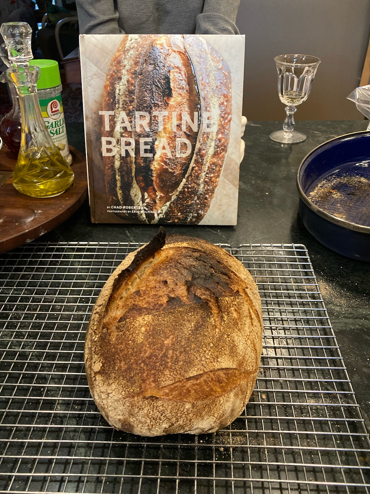
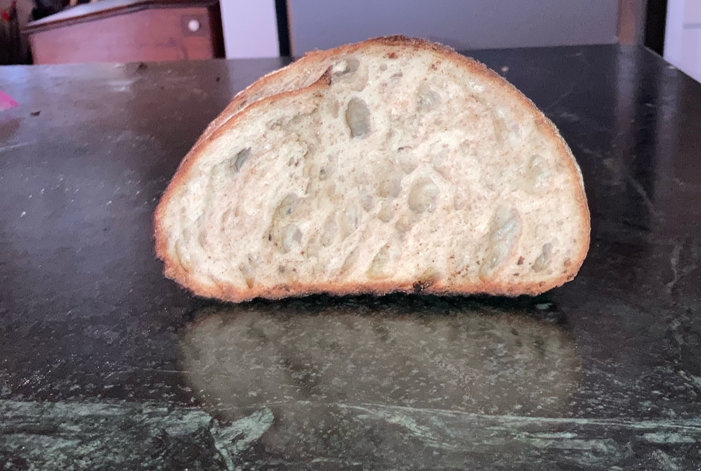

# Bread 

## Getting Started

While I've tried to include everything you need to know in order to bake all of these recipes, I have not included a lot of background information on the whys and wherefores of the processes.  For that, I strongly recommend that you purchase the following two books And get physical books, not ebooks.  Ebooks are not good for all the page-flipping you will want to do.

1. *Artesan Bread at Home* by Peter Reinhardt.  This is the book I started with, and it remains a go-to source.  It walks you through [making and maintaining starter](#starter), and my recipes for [Pan au Levain](#pal) and [pizza dough](#pizzadough) originated there.  There are lots of other good recipes (both sourdough and conventional) that you may want to try.
2.  *Tartines*, by Chad Robertson.  This book took me to the next step of sourdough baking.  It is a different kind of book, in that a) it is very autobiographical, an b) it is mostly built around [a single recipe](#tartines).  It is also extremely well illustrated, so I'd suggest having it at hand when you follow my condensed versions of his recipes.

## What you will need

### Flours {#flour}

Volumes gave been written on the virtues and shortcoming of all kinds of flour.  For the casual baker, but of that can be ignored, however there are a few basics that need to be kept in mind.

#### Sources

I have the good fortune of having access to an excellent bulk food store (Sauder's Store in Seneca Falls, NY), so I can buy 25 pound bags of flour for about $18.00.  Because I can only get there a couple of times a year, I usually buy 2-3 bags and them store them in a sealed plastic tub.  I've never had any problems with weevils.  If you live near a similar source, go for it.  However, if you don't, King Arthur varieties are always good (for high gluten choices,  "Bread Flour" works well; their "Sir Lancelot" is the best).

#### Bread vs. All Purpose.

The big difference here is gluten.  Fortunately, none of my family have any problems with gluten, so my motto is the more the merrier.  This is where bread flour comes in - it is simply white flour that is high in gluten.  Use of bread flour leads to a more elastic dough and a more open texture of the resulting loaf.

#### Whole Wheat Flour

I've never been a fan of 100% whole wheat bread, however adding a small amount (maybe 10-20% of the total) tends to improve the flavor (and perhaps marginally the nutritional value) of most bread recipes.  It is an essential part of both Pan au Levain and Essential Tartine Bread, and can be added to most of the other recipes (however I don't recommend it for Dinner Rolls, and adding it to pizza dough is a matter of taste).  It pays to get high quality stone ground whole wheat flour - you'll pay a little more for it, but one bag goes a long way. 

## Making the starter {#starter}

### Getting it Started

### Maintaining and Recharging

Reinhardt recommends recharging the mother starter at least once a week.  I find that not to be necessary (at least with my starter) - doing so every 3-4 weeks has proven to be adequate.  However, my qualitative observation is that the longer I've left it in the refrigerator, the longer the recharge fermentation takes. Only once or twice has following the recipe below failed; in that case I go back to step xxx in the process I used to make the starter in the first place and go from there.  The normal recharge procedure is as follows:

> 2 3/4 cups bread flour (add some whole wheat if you like)  
> 1 cup warm water  
> 3/4 cup mother starter  

1.  Mix all of the ingredients together using a non-metalic spoon/spatula or your fingers.  
2.  Transfer to a clean ceramic bowl and cover with food service wrap
3.  Place in a warm place overnight, or until the starter has nearly doubled in bulk and is very bubbly.
4.  Transfer to a sealed food storage container and store in the refrigerator.  I do recommend labeling the container with the date it was made.

## Recipes

### Pan au Levain {#pal}

This is our go-to Reinhardt-style bread, and I give him all of the credit for suggesting the ingenious trick of adding whole wheat flour to the starter.  My addition was to hybridize it with the Robertson approach to proofing, shaping and baking.  I think you will be more than pleased with the results.

### Pizza Dough {#pizzadough}

### Sourdough Rolls {#rolls}

Below are two recipes from Amy Duska at [Little Spoon Farms](https://littlespoonfarm.com/), a great source for sourdough ideas.  Like me, she is self-taught in the art of sourdough baking, and her recipes are geared towards others with similar aspirations.  Below are two of her recipes, each with a few tweaks I've incporated.

#### Dinner Rolls {#drolls}

I cooked these for Thanksgiving dinner, and I anticipate doing so from here on out (as well as any other occasion that calls for them).  They are like store-bought dinner rolls, however the sourdough imparts more flavor.  Like most of the recipes I've used, this is a three day process - make the starter (overnight), mix the dough and do primary fermentation (day 2), do refrigerated secondary fermantation over night, and shape and bake (day 3).

#### Day 1

Make the starter as follows:

> 1 tbsp mother starter  
> ~1/3 cup flour (either bread or all purpose)  
> 3.5 tbsp water  

Combine the above in a small bowl, cover with food service wrap, and let it rise in a warm place overnight.

#### Day 2

Dough ingredients:

> 2 tbsp melted butter  
> 1 cup (240 gm) milk  
> 3 tbsp (44 gm) sugar  
> 1 tsp (5 gm) salt  
> 1/2 cup (100 gm) starter  
> 3 cups + 2 tbsp (375 gm) bread flour  
> 1 tbsp melted butter to brush on surface after baking  

Mixing the dough:

1.  Combine butter, sugar, milk and salt and warm over low heat until butter is melted.  transfer to mixer bowl and let cool to room temperature.
2.  Add flour and starter and mix with paddle attachment at low speed, until the ingredients are mixed and hydrated.
3.  Transfer dough to a ceramic bowl, cover with a dish towel, and let it stand for an hour.
4.  Now comes our first exposure to tartine-style stretching and folding. Uncover the dough, and with moistened clean hands, pick up the dough from one side, stretch it a bit, and fold over what's in the bowl.  Repeat this process three times, rotating the bowl 1/4 turn before each one.
5.  Repeat step four two more times, allowing 30 minutes of rising time between each stretch and fold.
6.  Cover the bowl with food service wrap and refrigerate overnight.

#### Day 3

Today is shaping and baking day, a good day to plan for delicious fresh rolls with dinner!

1.  Remove the dough from the refrigerator and let it warm 1-2 hours.
2.  Put dough on a surface dusted with rice flour and divide into 12 roughly equal pieces of ~65 grams each.
3.  Shape each piece into a ball by turning up the sides and pinching them together.  Arrange in a 9 X 13 inch baking dish dusted with rice flour (either a glass or a ceramic dush will work), cover with a towel, and let rise 3-4 hours.
4.  Preheat your oven to 375^o^ F.  Brush the surface of the rolls with melted butter and bake 25-30 minutes until golden brown.

### Parmesan Bubble Loaf

This is a combination of two recipes, the [dinner roll](#drolls) recipe we've already seen and the recipe from another old but excellent cookbook - *A World of Breads* by Dolores Casella.  We used the first to make the dough and the second to process and bake the bread.

*Ingredients*

> A batch of [dinner roll dough]($drolls), processed through Day 2 (in other words, substitute the following for the Day 3 instructions).  
> 1/2 cup parmesan cheese, grated.  
> 2 cloves garlic, grated or smashed  
> 1/2 cup butter  

1.  After the dough has warmed from its overnight fermentation, gently fold in the parmesan (note that this could have been done when mixing the dough, but I forgot).
2.  Divide the dough into 14 pieces and shape into balls.
3.  Melt the butter, add the garlic and cook briefly.
4.  Lightly oil a standard bread loaf pan.  Roll each ball of dough in the garlic/butter mix and stack in the loaf pan.
5.  Cover with a kitchen towel and allow it to rise 3-4 hours.
6.  Bake at 400^o^ F. for ~45 minutes until the top of the loaf is golden brown.

### Ciabatta rolls

### Essential Tartine Bread {#tartines}

{width=100%} 

### Tartine Baguettes {#baguettes}
