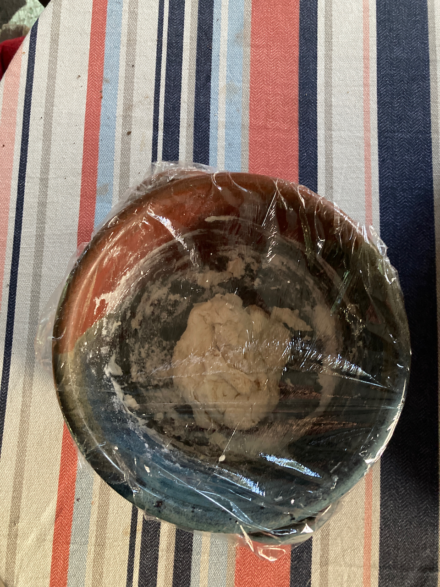
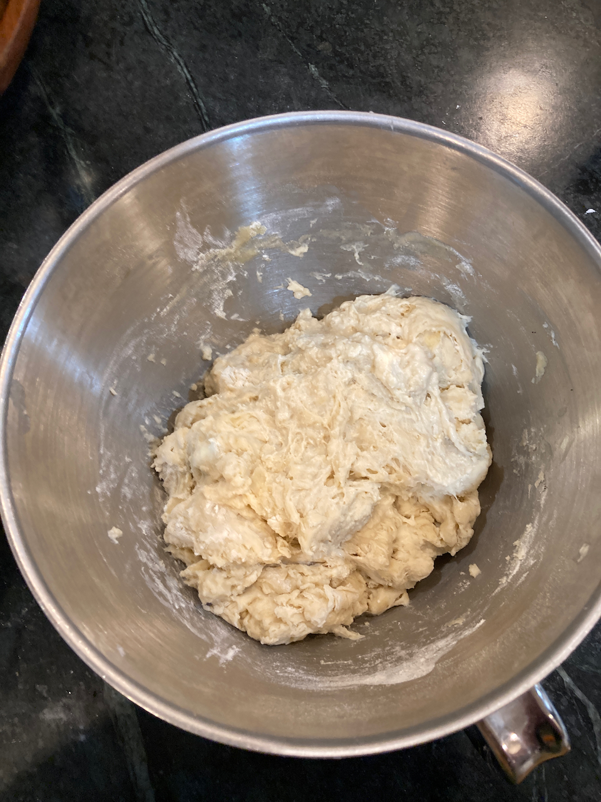
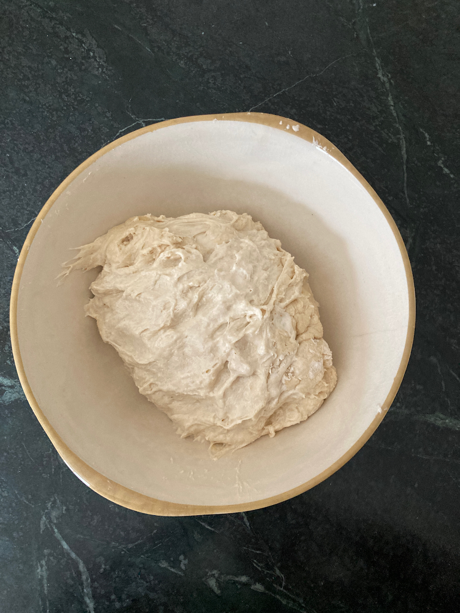
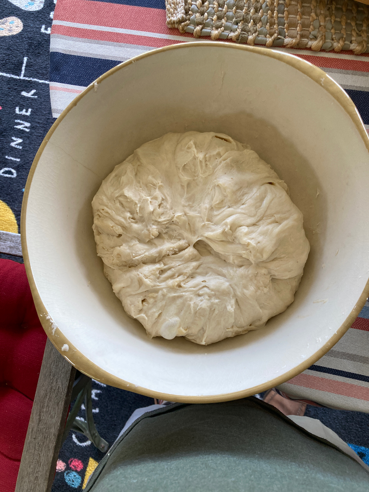
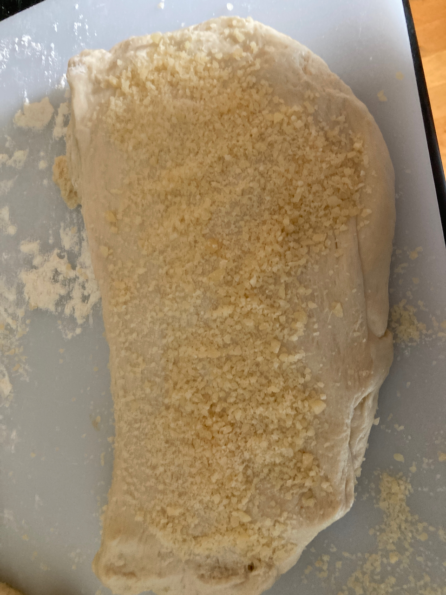
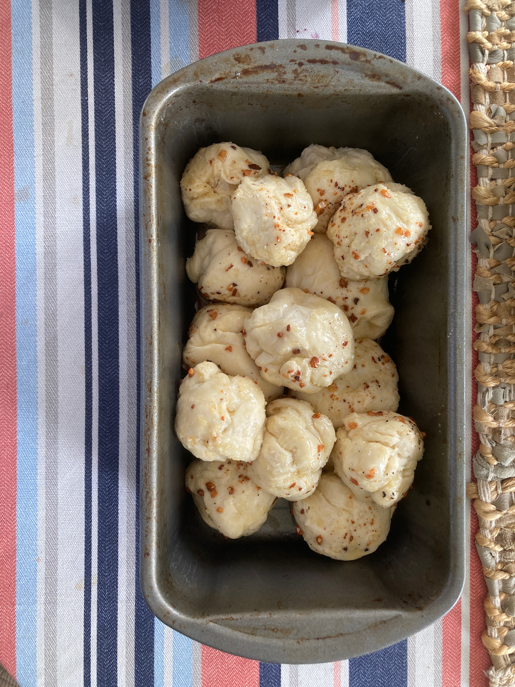
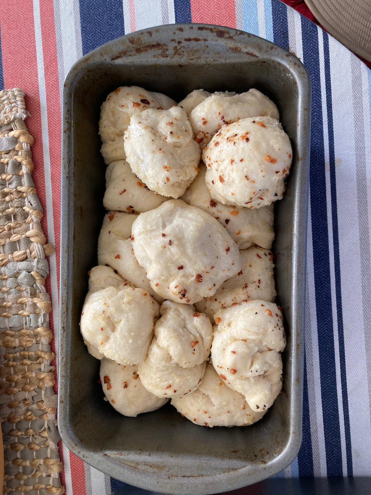
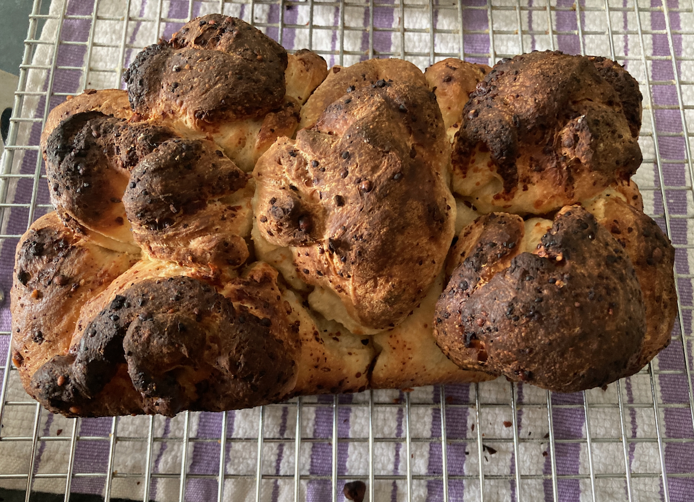
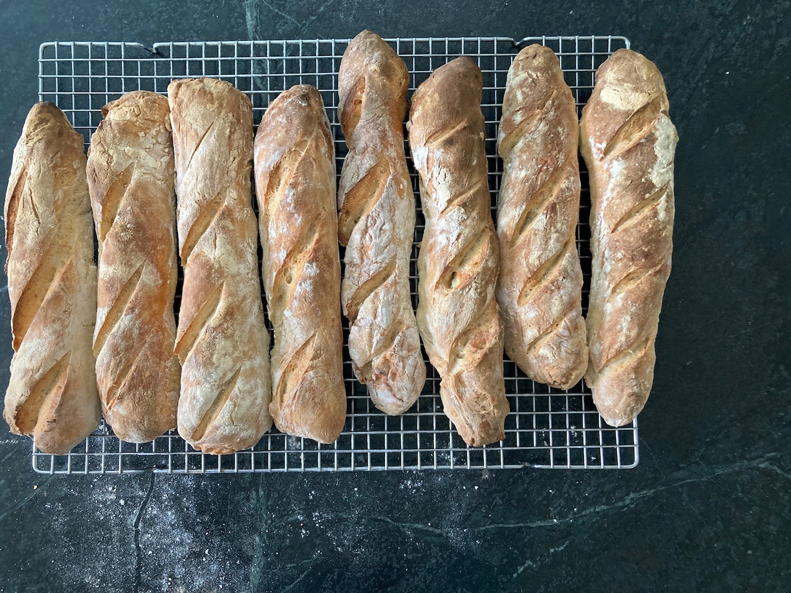

# Bread

## Getting Started

While I've tried to include everything you need to know in order to bake
all of these recipes, I have not included a lot of background
information on the whys and wherefores of the processes. For that, I
strongly recommend that you purchase the following two books And get
physical books, not ebooks. Ebooks are not good for all the
page-flipping you will want to do.

1.  *Artesan Bread at Home* by Peter Reinhart. This is the book I
    started with, and it remains a go-to source. It walks you through
    [making and maintaining starter](#starter), and my recipes for [Pan
    au Levain](#pal) and [pizza dough](#pizzadough) originated there.
    There are lots of other good recipes (both sourdough and
    conventional) that you may want to try.
2.  *Tartines*, by Chad Robertson. This book took me to the next step of
    sourdough baking. It is a different kind of book, in that a) it is
    very autobiographical, an b) it is mostly built around [a single
    recipe](#tartines). It is also extremely well illustrated, so I'd
    suggest having it at hand when you follow my condensed versions of
    his recipes.

## What you will need

### Flours {#flour}

Volumes have been written on the virtues and shortcoming of all kinds of
flour. For the casual baker, but of that can be ignored, however there
are a few basics that need to be kept in mind.

#### Sources

I have the good fortune of having access to an excellent bulk food store
(Sauder's Store in Seneca Falls, NY), so I can buy 25 pound bags of
flour for about \$18.00. Because I can only get there a couple of times
a year, I usually buy 2-3 bags and them store them in a sealed plastic
tub. I've never had any problems with weevils. If you live near a
similar source, go for it. However, if you don't, King Arthur varieties
are always good (for high gluten choices, "Bread Flour" works well;
their "Sir Lancelot" is the best).

#### Bread vs. All Purpose.

The big difference here is gluten. Fortunately, none of my family have
any problems with it, so my motto is the more the merrier. This is where
bread flour comes in - it is simply white flour that is high in gluten.
Use of bread flour leads to a more elastic dough and a more open texture
of the resulting loaf.

#### Whole Wheat Flour

I've never been a fan of 100% whole wheat bread, however adding a small
amount (maybe 10-20% of the total) tends to improve the flavor (and
perhaps marginally the nutritional value) of most bread recipes. It is
an essential part of both [Pan au Levain](#pal) and [Essential Tartine
Bread](#tartines), and can be added to most of the other recipes
(however I don't recommend it for Dinner Rolls, and adding it to pizza
dough is a matter of taste). It pays to get high quality stone ground
whole wheat flour - you'll pay a little more for it, but one bag goes a
long way.

## Making the starter {#starter}

### Getting it Started

### Maintaining and Recharging

Reinhart recommends recharging the mother starter at least once a week.
I find that not to be necessary (at least with my starter) - doing so
every 3-4 weeks has proven to be adequate. However, my qualitative
observation is that the longer I've left it in the refrigerator, the
longer the recharge fermentation takes. Only once or twice has following
the recipe below failed; in that case I go back to step xxx in the
process I used to make the starter in the first place and go from there.
The normal recharge procedure is as follows:

> 2 3/4 cups bread flour (add some whole wheat if you like)\
> 1 cup warm water\
> 3/4 cup mother starter

1.  Mix all of the ingredients together using a non-metalic
    spoon/spatula or your fingers.\
2.  Transfer to a clean ceramic bowl and cover with food service wrap
3.  Place in a warm place overnight, or until the starter has nearly
    doubled in bulk and is very bubbly.
4.  Transfer to a sealed food storage container and store in the
    refrigerator. I do recommend labeling the container with the date it
    was made.

## Recipes

### Pan au Levain {#pal}

This is our go-to Reinhart-style bread, and I give him all of the credit
for suggesting the ingenious trick of adding whole wheat flour to the
starter. My addition was to hybridize it with the Robertson approach to
proofing, shaping and baking. I think you will be more than pleased with
the results.

### Pizza Dough {#pizzadough}

### Sourdough Rolls {#rolls}

Below are two recipes from Amy Duska at [Little Spoon
Farms](https://littlespoonfarm.com/), a great source for sourdough
ideas. Like me, she is self-taught in the art of sourdough baking, and
her recipes are geared towards others with similar aspirations. Below
are two of her recipes, each with a few tweaks I've incporated.

#### Dinner Rolls {#drolls}

I cooked these for Thanksgiving dinner, and I anticipate doing so from
here on out (as well as any other occasion that calls for them). They
are like store-bought dinner rolls, however the sourdough imparts more
flavor. Like most of the recipes I've used, this is a three day
process - make the starter (overnight), mix the dough and do primary
fermentation (day 2), do refrigerated secondary fermantation over night,
and shape and bake (day 3).

#### Day 1

Make the starter as follows:

> 1 tbsp mother starter\
> \~1/3 cup flour (either bread or all purpose)\
> 3.5 tbsp water

Combine the above in a small bowl, cover with food service wrap, and let
it rise in a warm place overnight.

{width="40%"} 
{width="40%"}

Starter Before and After Overnight Fermentation

#### Day 2

Dough ingredients:

> 2 tbsp melted butter\
> 1 cup (240 gm) milk\
> 1 tbsp (44 gm) sugar\
> 1 tsp (5 gm) salt\
> 1/2 cup (100 gm) starter\
> 3 cups + 2 tbsp (375 gm) bread flour\
> 1 tbsp melted butter to brush on surface after baking

Mixing the dough:

1.  Combine butter, sugar, milk and salt and warm over low heat until
    butter is melted. transfer to mixer bowl and let cool to room
    temperature.
2.  Add flour and starter and mix with paddle attachment at low speed,
    until the ingredients are mixed and hydrated.
3.  Transfer dough to a ceramic bowl, cover with a dish towel, and let
    it stand for an hour.
4.  Now comes our first exposure to tartine-style stretching and
    folding. Uncover the dough, and with moistened clean hands, pick up
    the dough from one side, stretch it a bit, and fold over what's in
    the bowl. Repeat this process three times, rotating the bowl 1/4
    turn before each one.
5.  Repeat step four two more times, allowing 30 minutes of rising time
    between each stretch and fold.
6.  Cover the bowl with food service wrap and refrigerate overnight.

{width="70%"}

After initial mixing

{width="40%"} 
{width="40%"}

Dough before (left) and after (right) stretching and folding. Note that
the dough has expanded in volume and has a smoother surface. It also
becomes much more elastic.

#### Day 3

Today is shaping and baking day, a good day to plan for delicious fresh
rolls with dinner!

1.  Remove the dough from the refrigerator and let it warm 1-2 hours.
2.  Put dough on a surface dusted with rice flour and divide into 12
    roughly equal pieces of \~65 grams each.
3.  Shape each piece into a ball by turning up the sides and pinching
    them together. Arrange in a 9 X 13 inch baking dish dusted with rice
    flour (either a glass or a ceramic dush will work), cover with a
    towel, and let rise 3-4 hours.
4.  Preheat your oven to 375^o^ F. Brush the surface of the rolls with
    melted butter and bake 25-30 minutes until golden brown.

### Parmesan Bubble Loaf

This is a combination of three recipes, the [dinner roll](#drolls)
recipe we've already seen, the recipe from another old but excellent
cookbook - *A World of Breads* by Dolores Casella, and the technique for
making cheese breads from Reinhart. We used the first to make the dough
and the others to process and bake the dough.

Note that this recipe, as given previously, makes enough dough for one
loaf. I usually double everything to make two - one to eat right away
(it doesn't last long!) and one to freeze for later.

*Ingredients*

> A batch of [dinner roll dough]($drolls), processed through Day 2 (in
> other words, substitute the following for the Day 3 instructions).\
> 1/2 cup parmesan cheese, grated. (3/4 cup if doubled)\
> 2 cloves garlic, grated or smashed (3 if doubled)\
> 1/2 cup butter (3/4 if doubled)  
> 1 batch dough

1.  After the dough has warmed from its overnight fermentation, gently
    flatten it on a floured work surface
2.  Fold in the parmesan, divide the dough into 14 pieces and shape into
    balls.
    -   If you are doing a double batch, divide it into two halves and process each as above.
3.  Melt the butter, add the garlic and cook briefly.
4.  Lightly oil a standard bread loaf pan. Roll each ball of dough in
    the garlic/butter mix and stack in the loaf pan.
5.  Cover with a kitchen towel and allow it to rise 3-4 hours.
6.  Bake at 400^o^ F. for \~45 minutes until the top of the loaf is
    golden brown.

{width="70%"}

Flattened dough with cheese sprinkled on it.

{width="35%"}
{width="35%"}

Unbaked loaf before and after the final rise.

{width="80%"}

The final product

### Ciabatta rolls

### Essential Tartine Bread {#tartines}

{width="50%"}

My first loaf and the source of the recipe

It is fair to say that Alice's gift of the book *Tartine Bread* by Chad
Robertson revolutionized my approach to bread making. Instead of calling
for relatively stiff dough kneaded either by hand or in a stand mixer, a
series of gentle stretch and folds is used during the bulk fermentation
of a very soft dough. I have incorporated a stand mixer into the initial
combining of ingredients - it saves a lot of mess - but otherwise I
follow the original handling instructions (I have adjusted the flour
ratio somewhat, but that was a matter of personal taste). If you want to
go this route, it may involve some investment, but the results will be
worth it.

So first, [**buy the
book**](https://www.amazon.com/Tartine-Bread-Chad-Robertson/dp/0811870413/ref=sr_1_1?crid=384YPG5Z4NS52&keywords=tartine+bread&qid=1659704334&sprefix=Tartine%2Caps%2C563&sr=8-1).
It is available (and quite inexpensive) as an Amazon ebook, but I
strongly recommend spending the bucks (currently \$20.49) for the
printed version.

Then there are the items described in the [Kitchen
Essentials](#essentials) section - a kitchen scale, a bench knife,
proofing baskets, and a dutch oven/oven roaster. I already had the
roasting pan, but I needed to buy the rest. As I recall, the total cost
of those items was something on the order of \$60.

#### My method

What I describe below is a bare bones set of instructions for making
this bread. The book provides much more detail, along with copious
illustrations. You might also want to watch [this
video](https://youtu.be/fBDmPOZ_FJk?list=FLQh2uXeVOD3hCYVa6ueNFkA) to
see the process in action.

#### The Leaven (or Starter)

> 1 Tbsp mother starter\
> 100 gm bread flour\
> 100 gm whole wheat flour   
> 200 gm. Water  

Mix these ingredients and let it rise at room temperature overnight in a
container sealed with food service wrap.

#### Preparing the Dough

**Ingredients**

700 + 50 gm. Water (80^o^ F.)\
200 gm. leaven\*\
900 gm. bread flour\
50 gm. whole wheat flour\
10 gm. salt

\* This will not be all of the starter. If you wish, the
unused portion can be used to start a new batch of mother starter.

1.  Combine th 700 ml of warm water with the leaven, bread flour, and
    whole wheat flour in the bowl of your stand mixer. Mix with the
    paddle mixer on slow until the flour is fully hyrdated (about a
    minute.
2.  Let the dough stand for 25-40 minutes.
3.  Transfer the dough to a clean bowl (I use a ceramic one; Robertson
    recommends a clear plastic container).
4.  Add the salt and remaining water to the dough, and gently squeeze it
    in with your hands.
5.  You should allow for four hours of fermentation. During the first
    two hours, gently fold the dough with moistened hands, as described
    in the recipe for [dinner rolls](#drolls). You can continue folding
    during the last two hours, only be extremely gentle. The dough will
    have become more elastic, and its bulk will have increased by about
    20%.

#### Shaping the loaves

From here on out, the key word is **gently**. During the rise, the dough
will have become much more porous. We want to retain as much as possible
so that the final product will have the light texture we desire.

1.  Turn the dough out onto a very lightly floured work surface.\
2.  Divide the dough into two equal pieces with your bench knife, and
    flour the surfaces of each. Fold over the cut side of each so that
    there is a smooth floured circle on the top.
3.  Gently shape each piece into a smooth circle, cover them with a
    kitchen towel, and let them rest for 30 minutes.
4.  Flip each loaf with your bench knife or a large spatula, so that the
    floured side is now down.
5.  For each loaf, perform the following folds: -Fold the third of the
    dough closest to you over the middle third.
    -   Stretch the dough horizontally to the right and fold the
        rightmost third over the center.
    -   repeat this process for the left of the dough.
    -   Now fold the rear third of the dough over the middle. While
        holding that in place, fold up the front of the dough to create
        a seam down the middle of what will be the bottom of the loaf.
    -   Gently shape the loaf into an oval, stretching slightly to help
        seal the seam.
6.  Now dust your proofing baskets with a 50:50 mixture of white and
    whole wheat flour.
7.  Place each loaf into a basket **seam side up**, cover with food
    service wrap, and refrigerate overnight.

#### Baking

1.  Put your dutch oven or roaster into the oven and preheat it to
    500^o^ F.
2.  While the oven is preheating, remove the first loaf from the
    refrigerator and dust the surface with rice flour.
3.  When the oven has preheated, carefully remove the dutch oven from
    it.\
4.  Place the loaf into the shallow piece of the dutch oven and score
    the surface with two lengthwise parallel cuts about 1/4 inch deep. A
    serrated knife works well for this.
5.  Cover the bread with the deeper piece of the dutch oven and return
    it to your oven. Reduce the temperature to 450^o^ F.
6.  After 20 minutes, carefully remove the upper part of the dutch oven.
    You will release a lot of steam at this point, and the loaf should
    be just lightly browned.
7.  Bake for an additional 20-25 minutes until the crust is golden
    brown. Using a spatula, place it onto a cooling rack.
8.  Return the dutch oven to the oven and increase the heat to 500^o^ F.
9.  While the oven is reheating, take the second loaf out of the
    refrigerator and dust with rice flour, in preparation for repeating
    steps 3 to 7 above.

{width="70%"}

The inside of the finished product, showing the open crumb that results
from gentle handling of the dough.

### Tartine Baguettes {#baguettes}

This is our second recipe from *Tartine Bread*, one that is similar to
the previous one but with a couple of key differences:

1.  It uses both sourdough and commercial yeast starters in the dough.
2.  Mixing, rising and baking can occur all on the same day.

There are also two ways to bake the bread. The first is on your baking
stone, with a dish towel saturated in water placed in a shallow pan in
the oven to create steam - the method in the original recipe. The second
is one I devised - use a suitable cakepan placed on the stone for the
bread, and cover it with foil for the first 20 minutes of baking.

#### Starters

**Leaven (sourdough starter)**

> 1 tbsp. mother starter\
> 220 gm. all purpose flour\
> 220 gm water (80^o^ F.)

**Poolish (commercial yeast starter)**

> 200 gm. all purpose flour\
> 200 gm water (80^o^ F.)\
> 3 gm. active dry yeast

Mix the two starters in separate small bowls, cover with food service wrap and place in a warm location overnight.

#### Mixing and Fermenting

400 gm. leaven (all of it)\
400 gm. poolish (ditto)\
500 + 25 gm. water (75-80^o^ F.)\
650 gm. all purpose flour\
350 gm. bread flour\
10 gm. salt

1.  Combine leaven, poolish, 500 gm. of water and both flours in bowl of
    stand mixer. Mix with paddle attachment at low speed until all of
    the flour is hydrated (\~1 minute). Cover with cloth and let stand
    30-60 minutes.
2.  Transfer to a clean bowl and add salt and the remaining water. Work
    them in with your hands.\
3.  Let the dough rise in a warm place, gently folding every 40 minutes,
    until the dough becomes puffy and springy (3-4 hours).

#### Shaping

The first decision you will need to make is how many loaves you want to
make and when. I kind of like six, but you can do as few as 2 or as many
as 8. It all depends on the capacity of your oven and your ability to
put up with multiple round of baking. What follows is for six.

And in all candor, I'm still working on the best shaping method. This is
what I've come up with so far.

1.  Place the dough on a lightly floured surface and divide first into
    two equal pieces, each of which is divided three ways. If you are
    only going to bake half of the loaves immediately, put one half in a
    bowl, cover with food service wrap and refrigerate.
2.  Shape each piece into a rectangle and let it rest for 30 minutes.
3.  Cover a cookie sheet with a towel and dust it with rice flour.
4.  For each loaf, do the following:
    -   Position the rectangle with the long side towards you and fold
        the front third over the middle one.
    -   Stretch the dough so it nearly doubles in length and then fold
        the rear third back over the middle.
    -   Roll the dough gently with your hands to stretch it further and
        taper the ends.
    -   Place the loaf on one edge of the towel seam side up.
5.  Repeat step 4 for the next loaf. When you place it on the towel, do
    so such that a fold of the towel is positioned between it and the
    previous loaf.
6.  When all loaves are shaped, cover with another towel and let them
    rise for 2.5-3 hours.

#### Baking

As noted above, there are two methods that can be used.

**On a Stone**

1.  Position your stone on a middle rack. On a lower rack, place a
    shallow pan containing a water saturated dish towel.
2.  Preheat the oven to 500^o^ C.
3.  Invert the loaves onto a pizza peel and score the loaves with a 2-3
    long angled and parallel cuts.
4.  As soon as the oven reaches temperature, place as many loaves as
    will fit onto the stone using a pizza peel dusted with rice flour.
5.  Reduce the temperature to 475^o^ F. and bake for 15 minutes.
6.  Remove the pan with the towel and continue to bake for 15-25
    minutes, until the baguettes are golden brown. Reomove from the oven
    and place loaves on a cooling rack.
7.  Repeat steps 2 through five as many times as necessary to bake all
    of your baguettes.

**In a pan**

1.  Preheat your oven to 500^o^ F, with your stone positioned on a
    middle rack
2.  Invert the loaves onto a large (9 X 13 in. or larger) cake pan.
    Score the loaves as above Cover with aluminum foil.\
3.  Place the pan onto the baking stone in the oven, lower the
    temperature to 475^o^ F. and bake for 20 minutes.
4.  Remove the foil and continue to bake for another 15-25 minutes,
    until the loves are a rich golden brown.
5.  Place bake loaves on a cooling rack.
6.  Repeat the above as needed to bake all of the loaves.

{width="60%"}

The final product. In this case, the dough was divided into eight loaves
and all were baked on a pizza steel (method 1) on the same day.

