# Big Green Egg {#bge}

So what is a Big Green Egg?  A more generic name is a komodo cooker - a heavy duty ceramic charcoal cooker, shaped like the ubiquitous Weber Cooker, but much heavier and more expensive.  If your budget can afford it, I recommend spending the bucks for an Egg, especially if you anticipate doing a lot of low temperature barbecuing.  It is much easier to control the temperature than in a Weber-style device, and a load of charcoal goes a lot longer (an 18 hour barbecue of pork butt or brisket can be completed on a single generous charcoal load).  Also, with proper handling, one will last forever, so that while the upfront costs are a challenge, over time you may end up saving money - in my prior life, I found that metal cookers had a lifespan of something like 3-5 years.

With respect to what size to get, I strongly recommend the large (original) Egg.  As I mentioned earlier, we started with a medium (recommended for cooking for 2) but quickly found it to be overly constraining - I could barely fir four ears of [corn on the cob](#corn) into it.  Furthermore, you can forget grilling multiple different items at the same time.  

>Note that there is an extra large model, which is huge.  If you have a big family or are a grilling fanatic, you might want to consider it, but is is far larger than anything I can foresee ever needing.  

## Charcoal and Lighting

There are two cardinal rules regarding what to use in a Green Egg:

1.  **NEVER use lighter fluid.  It will soak into the ceramic and ruin your investment.**
2.  **Only use lump charcoal, not briquets, essentially for the same reason.**

The instructions for you Egg will recommend that you only use "genuine Big Green Egg Charcoal".  Ignore that advice.  Yes, BGE charcoal is high quality, but a) it is expensive, and b) it may be hard to find.  I have been using supermarket-branded lump charcoal for years and have found it to be quite satisfactory.

With respect to lighting, most sources recommend using a chimney, in which you mix some charcoal and some paper.  The paper is ignited, and when the charcoal is burning, the chimney is removed and more charcoal is added as needed.  I'll be honest - I've never tried this.  Rather, I load the charcoal into the egg, insert 2-3 paraffin-saturated composit sticks into it, and then ignite them.  With this method, I reliably get a nice bed of hot coals in 10-15 minutes.

## Accessories

### The Basics

For grilling, it certainly is possible to use your new Big Green Egg "out of the box", however a number of accessories, from the mundane to the sophisticated (and of course from cheap to expensive) help to greatly expand your grilling and barbecuing repertoire.  Here are a few I find to be invaluable:

1.  An **ash tool**, something you should order when you purchase your Egg.  It is absolutely necessary for removing ashes from the Egg through the lower vent.  
2.  A **garden trowel**,  which facilitates arranging the charcoal once it is in the egg.
3.  A [**ConvEGGctor**](https://biggreenegg.com/product/conveggtor/).  I hate the name, but it's a great device if you want to use your egg more like an oven than a grill.  I routinely use it with brisket and smoked pork, and also for bread, which I occasionally cook in the Egg.

There is, of course, a bunch of other stuff you will want to have, such as a grill brush, standard grilling tools, and some heavy duty oven mitts, but those are largely items of personal preference.  I'll now turn to the the critical issue of temperature control.

### Temperature Control

One of the great advantages of the Big Green Egg is that, with a little practice, you can control the temperature when the lid is closed.  The question is how.  They come with a dome thermometer, but they are notoriously inaccurate.  So what to use in its place?  

There are two temperatures that really matter, especially when barbecuing.  The first is the **grill temperature**; the second is the **internal temperature** of what you are cooking.  And because you don't want to be opening and closing the lid any more than necessary, it is valuable to have a **remote monitoring system** for both.

For all matters of temperature and time, I am a big fan of [Thermoworks](https://www.thermoworks.com/).  Not only do they make high quality devices, but their website is an excellent source of recipes, ones we will be referring to frequently.  If you sign up for their newsletter, you will receive only one email a day.  Some of them are purely promotional, but others contain links to recipes you may want to explore.  These are their devices I've used over the past decade or so, ranging from the most basic to the most elaborate.

1.  [The ChefAlarm Thermometer and Timer](https://www.thermoworks.com/chefalarm/) was my first device, and it is very useful for indoor cooking.  It will monitor a single temperature and has both time monitoring and high and low temperature alarms.  It comes with a single probe for monitoring internal temperatures, meaning that it can't be used to monitor both internal and grill temperatures.  In addition, it does not have remote monitoring (Bluetooth or WiFi) capabilities.  
2.  So, if you want to go further, there are two items to start with.  The first is a **standalone timer**.  While Thermoworks is in the business of selling temperature controlled devices, it also offers an excellent selection of time monitoring devices.  My personal favorite is [the Extra Big and Loud Timer](https://www.thermoworks.com/extra-big-loud/) - it is very simple and straightforward to use.  Of course all kinds of timers can be had at grocery stores, kitchen stores, etc., so if you already have one of those (or wish to save money by buying one) that is a perfectly fine option.
3.  The second is an **instant read thermometer**,  a step up in the sophistication scale.  If you have an internal monitoring device, it only reads the temperature in one spot; other spots in the item cooking may be hotter or cooler.  The best device on the market right now is the [Thermopen One](https://www.thermoworks.com/thermapen-one/), which has a one second response time.  The [Classic Thermopen](https://www.thermoworks.com/classic-thermapen/) is also a fine option, having a response time of 2-3 seconds, and which is about $20 less expensive.
4.  Now we get into the heavy duty stuff - **multiple channel devices with remote monitoring capabilities**.  I've already addressed why multiple channel monitoring is important (for both grill and internal monitoring); we sometimes can use one or two additional channels (such as grilling or barbecuing poultry, where keeping track of both thigh and breast temperatures are important).  Thermoworks has two options to be considered.  The first is the [Smoke](https://www.thermoworks.com/search.php?search_query=smoke) series of devices.  The most inexpensive ($99 at time of writing) has two channels and basic blutetooth capabilities, and comes with one internal and one grill temperature probe.  Moving up in sophistication (and price) are the Smoke X2 and Smoke X4, both of which use longer distance RF transmission and have 2 and 4 channels respectively. But the absolute best (and what I use exclusively) is the [Signals](https://www.thermoworks.com/signals/) bluetooth and wifi device.  It can be controlled by a reasonably functional smart phone app, and with it connected to your WiFi network, you can actually monitor temperatures from anywhere in the world.  That may seem silly, but when you're doing a 16 hour barbecue of a brisket or a pork butt, that may prove to be useful - you will not be tied to your home for the duration. Indeed, when you use a temperature control device (see below) you can actually make adjustments to the cooking temperature from afar.
5.  Of course, **probes** are an essential part of any temperature monitoring system.  All of the above devices come with an adequate selection of probes, but there are a large number of different ones available.  One I use a lot is a [High Temperature Needle Probe](https://www.thermoworks.com/tx-1015x-n2/), which is shorter, making it ideal for monitoring small or thin items like chicken wings or fish.  Also, although I was skeptical at first, I have found [Probe Spools](https://www.thermoworks.com/silicone-probe-spool/) to be an incredible convenience.  They all but eliminate tangling and kinking, things that can greatly reduce probe lifetimes.
6.  So far we've dealt with temperature monitoring, but what about **Temperature Control**?  We are now at the ultimate high end of sophistication.  The device for doing so is the [Billows Temperature Control Fan](https://www.thermoworks.com/billows/), a fan that attaches to the lower vent of a barbecue device and, in combination with a Smoke or a Signals device, does its best to control the chamber temperature.  I always use it for low temperature cooking, and if I do so carefully, it is a godsend.  BUT, two caveats:  
    - It requires electricity.  I am fortunate enough to have an outdoor plug near my outdoor cooking area, but if you don't, you'll have to either rig up extension cords from the nearest outlet or spring for [a 12 Volt Battery Pack](https://www.thermoworks.com/billows-12v-battery-bank/), which actually costs more than the device itself ($99 vs. $79).  
    - It is really good for bring your grill up to temperature, but it is largely ineffective in bringing it down.  Thus, if you're doing a low temperature cook, it is critical that you get it attached, set, and running well before the chamber has reached your desired temperature.  

7.  Finally, how to store all this mess?  While it's not, in my opinion, Thermoworks' finest product, their [Extra Large Zippered Storage Case](https://www.thermoworks.com/tx-1017x-c2/) will hold all of my devices (which, just to review, are a Big and Loud Timer, a Thermopen, a Signals monitoring unit, a Billows control unit, and four probes on spools).  I've also managed to add some metal skewers that I use on occasion.

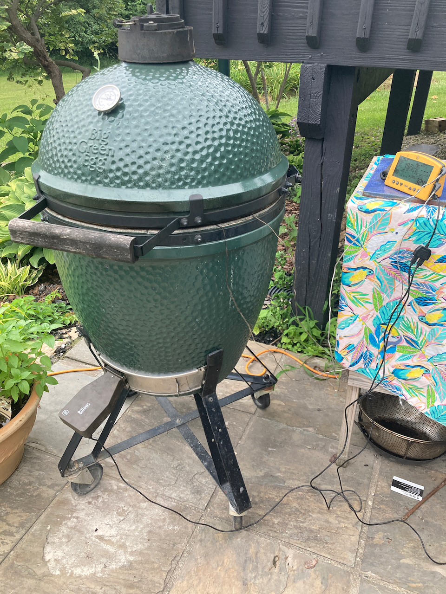{width=70%}

Big Green Egg with Billows and Signals attached.

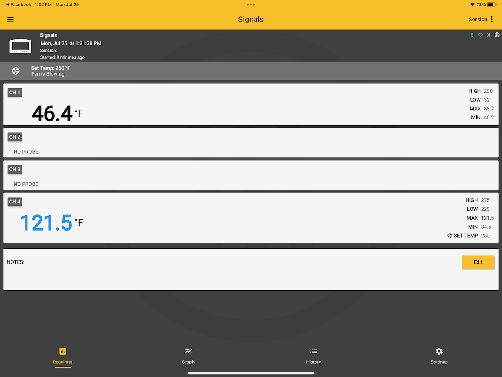{width=40%}&nbsp; 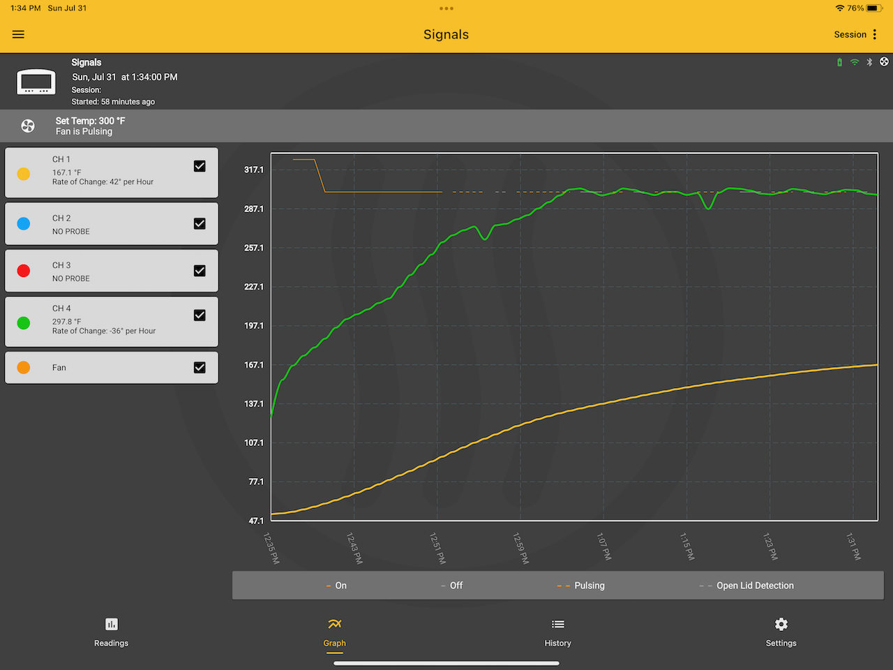{width=40%}

Screen shots of Thermoworks app display.  Left:  Readings screen, showing internal temperature (top) and grill temperature (bottom) at the beginning of a run.  Right:  Graph screen after one hour of cooking a tritip roast.  Grill temperature is in green and internal temperature is in gold.

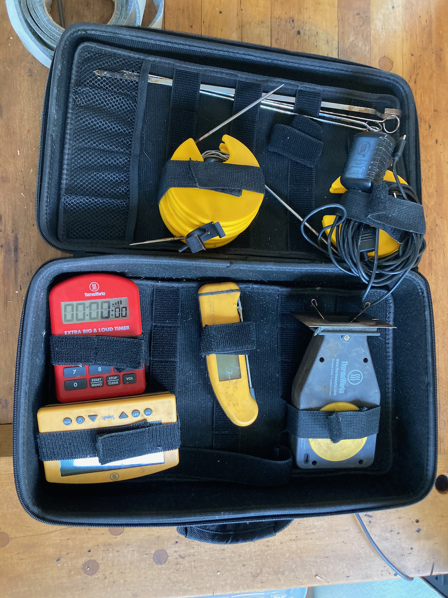{width=70%}

My temperature monitoring and control kit.  Clockwise from top:  Skewers, wiring for Billows, Billows device, Thermopen,  Signals controller, Big and Loud timer.

## Grilling {#grill}

### Chicken

### Corn on the cob {#corn}  

I am fortunate enough to have grown up in sweet corn country.  Indeed, one of my fondest childhood memories is, when we were visiting family friends on a farm in Macedon NY, the children (including me) were sent out in the field to pick fresh corn for the day's dinner.  From the field to the pot in 10 minutes - absolutely delicious!  Unfortunately, I then spent a big chunk of my life in Florida, and corn there simply doesn't measure up to what I grew up with.  Thus, it was absolutely wonder to discover, when I moved to Ohio in July of 2007 (peak corn season) that the corn here measures up to what I remember as a child.

So the first secret about corn on the cob is freshness.  Ideally, it should be cooked the day it is picked; with storage, even refrigerated, the sugar in the corn rapidly turns to starch.  I have eaten second day corn, which is satisfactory, but fresher is better.

So here's my method for cooking corn on the grill.  I'm not sure where I got the original recipe, but it's pretty basic and ubiquitous.

**Ingredients**

> 2-6 ears of fresh sweet corn, in husks  
> melted butter  
> fresh ground pepper  
> grated parmesan (optional)  
> butcher twine  

1.  Peel the husks back (do NOT remove them) and discard silks.
2.  Place corn into a large kettle of water and let soak for at least an hour.
3.  Remove the corn from the water, baste with melted butter, and sprinkle with pepper, Parmesan (if desired) and any other flavors you might like (dill is a popular one.
4.  Cut one ~8 inch piece of twine for each ear.  Wet them in water to make them easier to tie.
5.  Fold the husks up over the corn and tie together with twine.
6.  Place the corn on your grill preheated to 450^o^ and roast a total of 10 minutes, rotating the ears every 2.5 minutes.
7.  Remove ears from grill.  With neoprene mitts on, grasp the ear with one hand and the stem with the other.  Snap vigorously  and separate the stem and attached husk from the ear of corn (you may want to cut the twine with scissors first).
8.  Serve with just about anything.

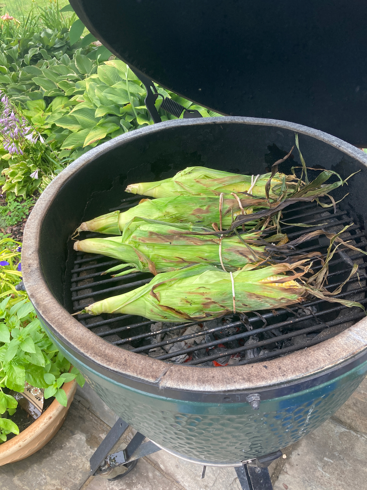{width=50%}

Corn  prepared as described and half way through grilling

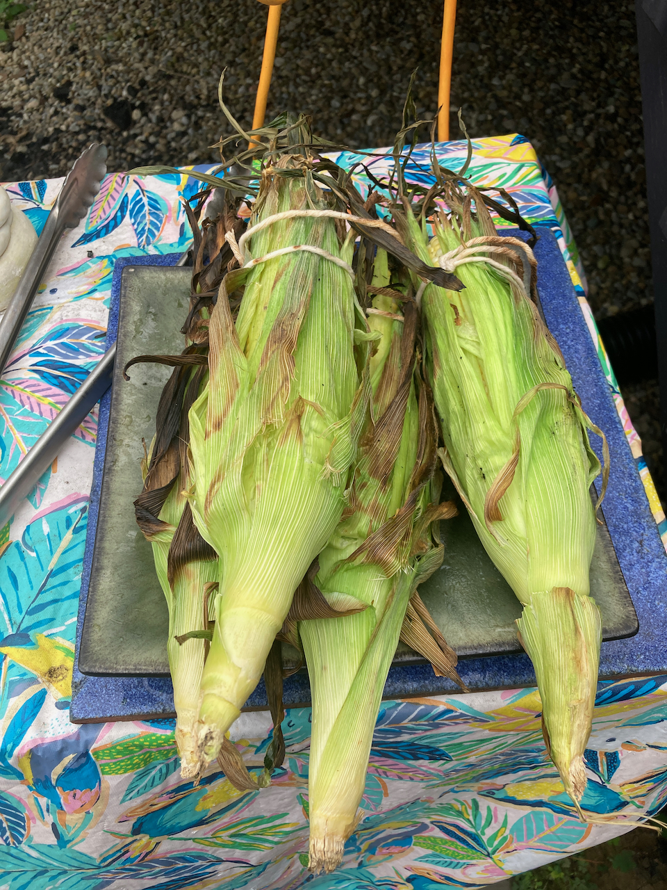{width=50%}

Grilling is complete

{width=50%}

Ready to eat

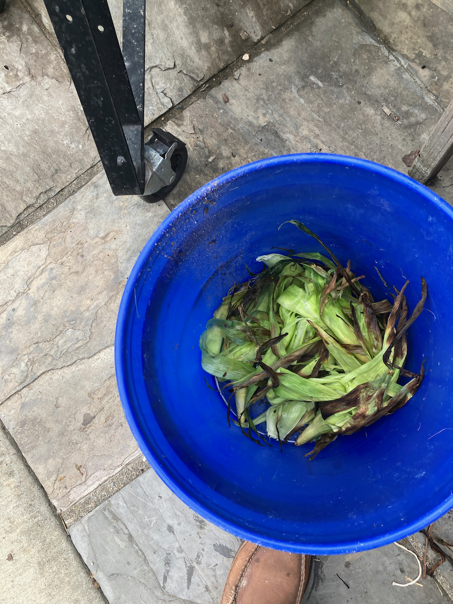{width=50%}

Ready for the compost pile.

### Fajitas

This recipe was originally one designed for the Instant Pot, but it is really easy to prepare it on a grill.  It can also be prepared on the stove top, substituting a heavy frying pan for the grill basket.

**Ingredients**

> ~3/4 lb beef, sliced into strips for stir fry (flank steak works well)  
> 2 tbsp fajita seasoning*  
> 1 bell pepper  
> 1 onion  
> Splash of  red wine  
> 1 lime, cut into wedges   
> Flour tortillas.

2.  Coat the beef with a tablespoon of fajita seasoning and the splash of red wine. Marinate for 30 min to an hour. 
1. Slice the vegetables and add the remaining sasoning
3.  Place the meat  in a grill basket and cook over a medium hot (450^o^ F.) grill until browned, about 3-5 minutes. Remove and set aside
4.  Add the vegetables to the basket and cook for about 10 minutes, until vegetables are cooked through.
6.  Add the meat to the mixture and cook for another 5-10 minutes.
7.  In your kitchen, briefly warm the tortillas on a frying pan over medium heat.  Place in a basket and cover with a kitchen towel.
8.  Serve the tortillas, filling and lime wedges for people to put together for guests to serve themselves. If desired, add your favorite hot sauce and/or sour cream (not my favorite).

*There are plenty good choices of fajita seasonings out there.  If you choose to make your own, here is the [recipe that I use](https://littlesunnykitchen.com/fajita-seasoning/).  If you are an instant pot user, you can find the original recipe [here](https://www.theinstantpottable.com/instant-pot-steak-fajitas/).

### Korean Chicken Skewers

This is another recipe from [*Southern Living](and is absolutely delicious and pretty easy to  prepare.  I cook these on metal skewers that are about 12 inches long and have a flat shape, so that the skewered food is easier to handle.

**Ingredients**

> 1/2 cup unsalted butter  
> 2 garlic cloves, peeled and grated  
> 1/3 cup honey
> 1 tsp kosher salt
> 1 tsp rice vinegar  
> 2 lb boneless skinless thighs, cut into 1 inch cubes  
> 1 large red onion, cut into wedges

1. Prepare your grill for direct cooking at 450^o^ F,
2.  Melt the butter on the stovetop over medium low heat.  
3.  Add the garlic and cook for about two minutes.
4.  Add the salt, vinegar and 2 Tbsp soy sauce, bring to a boil, and cook for about 2 minutes.  
5.  Toss the chicken with the remaining soy sauce.
6.  Thread the chicken and onion wedges onto skewers, adding two pieces of chicken followed by one onion wedge.
7.  Grill, basting often with honey butter mixture, for 10-12 minutes until chicken is light charred and cooked (if you want to check with an instant read thermometer, the internal temperature of the chicken should be ~165^o^.
8.  Serve over rice or bucatini.

## Barbecuing {#bbq}

### Some Basics

### Beef and Pork

#### [Brisket Style Tritip](https://blog.thermoworks.com/beef/brisket-style-tri-tip/) {#tritip}

This is a great place to start in your barbecue adventure.  Unlike a brisket, it is a small piece of meat,  more suitable for 1-2 people (although it will yield up multuple servings.  Furthermore, the cook time is reasonable (6-7 hours), and leftovers will keep in the refrigerator for days.

Ingredients:

> 2-3 pound Tri-tip roast  
>  Your favorite beef barbecue rub (I use [Penzey's Barbecue 3000](https://www.penzeys.com/online-catalog/bbq-3000/c-24/p-327/pd-s)  
> 3-4 Oak or Hickory Wood Chunks  
> Orange Butcher paper (available at [Lowes](http://www.lowes.com))

1.  Soak the wood chunks in water for at least 30 minutes.
2.  Load the barbecue with charcoal and add two Fire Starter Sticks.  Ignite.
3.  As soon as the flame dies down, add the soaked wood chips and stir them into the coals as best you can.
4.  Place your ConvEGGtor, and aluminum drip pan, and grill in place
5.  *Immediately* hook up your Billows device with a long probe in channel 1 and your grill monitoring probe (attached to the grill).  
6.  Using the Thermoworks app, set the fan temperature to 250^o^ F.  Close the upper vent on the Egg nearly completely
7.  Apply a binder to the tri-tip.  Mustard is the standard here, however I use olive oil.
8.  Apply rub liberally to all sides
9.  Insert a long probe into the heart of the roast and place on grill. Close the lid and let the cooking commence.

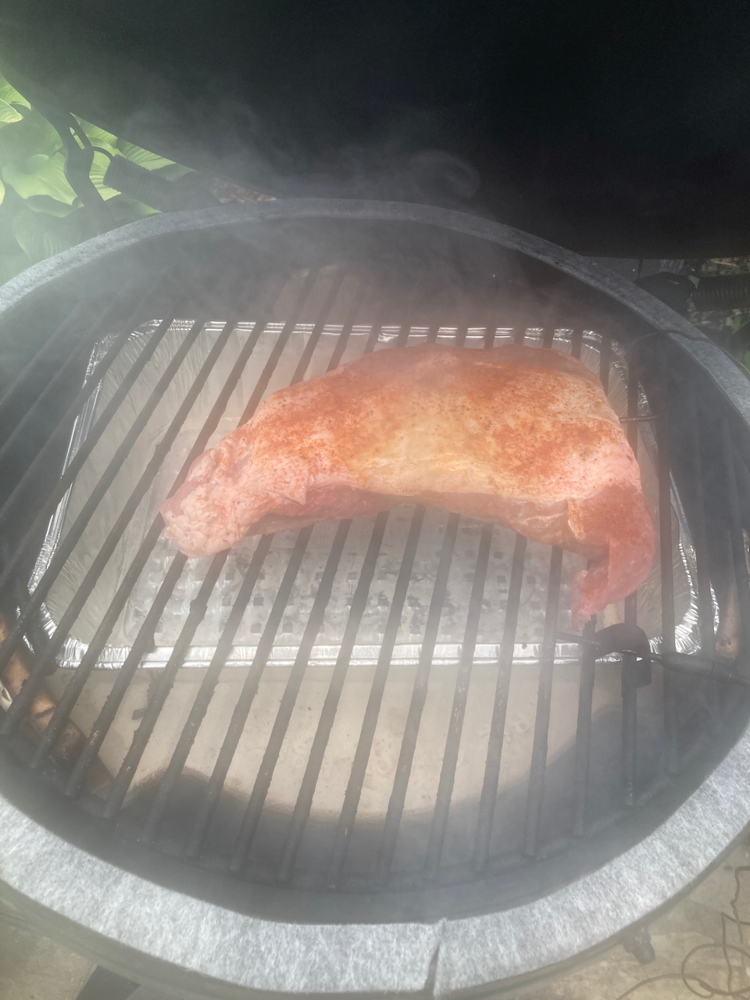{width=40%}&nbsp;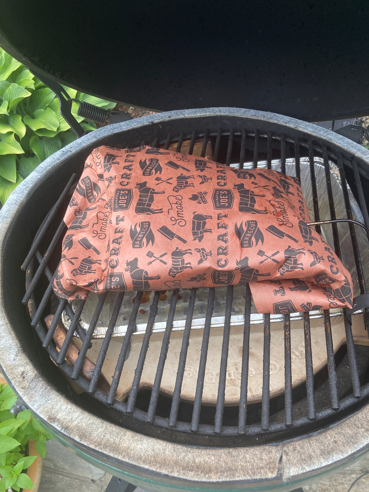{width=40%} 

Left: Beginning the barbecue Right: Tritip wrapped in butcher paper for final cook.

At this point, sit back, have a beer or a glass of wine, and keep an eye on time and temperature.  When the internal temperature reaches 150^o^ F. or when 2 hours have past (whichever comes first), proceed as follows:

1.  Remove the roast from the Egg, keeping lid-open time to a minimum.
2.  Wrap the roast in two layers of orange butcher paper.
3.  Return the roast to the Egg, and with the app, increase the grill temperature to 275^o^ F.
4.  When the roast has reached 200^o^ F. (about 3-4 hours), remove it and let it stand wrapped for 20 minutes or so.
5.  Slice and enjoy!

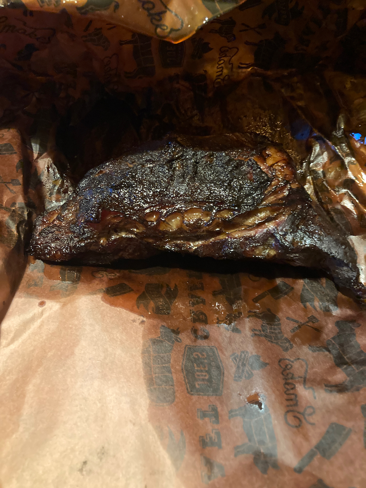{width=40%}&nbsp; 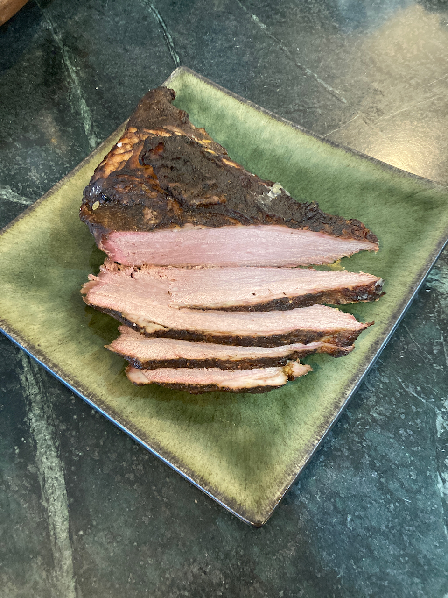{width=40%}

Cooked and sliced.

#### Roast beef for sandwiches

This is one that showed up in my inbox from [Thermoworks](https://blog.thermoworks.com/blog/homemade-deli-style-roast-beef/).  I haven't tried it yet, but I'm betting it will work well barbecued on the grill.  Note that the original recipe calls for a preliminary sear; I'm betting that smoking without the convEGGtor will get the job done.

**Ingredients**

> 1 eye round roast, 2-3 lb  
> kosher salt  
> black pepper  

1.  The night before you cook, salt the roast generously and place in the refrigerator covered.
2.  Prepare your grill for low temperature smoking at 200^o^.  You may or may not want to add wood chunks (oak or hickory).
3.  Rinse off excess salt, dry, and apply pepper.
4.  Barbecue at 200^o^ F until internal temperature reaches 120-130^o^ F. (lower for more rare meat, higher for more tender).
5.  Use your instant read thermometer to check for doneness.
6.  For ease of slicing, put roast in the refrigerator overnight.

#### [Pig Wings](https://blog.thermoworks.com/bbq-grilling/pig-wings/)

Despite the fact that we live near Cincinnati, home of the Flying Pig Marathon, these are not made from avian porcines.  Rather, they are partially deboned and trimmed pork shanks, prepared with a sauce similar to traditional buffalo wing sauce.  The meat may be available from a local butcher shop; online it can be had at [Porter Road](https://porterroad.com/) in Nashville (a great source of meat, but expensive, with high shipping costs).  Alternatively, you may be able to get properly trimmed pork shanks from your local butcher shop.

Like brisket or pork butt, shanks are full of connective tissue that must be broken down in order to yield a properly tender result.  This will occur if the meat is cooked to an internal temperature of 200^o^ F.  That processed is hastened by covering the pan containing "wings" and sauce for the second half of the cooking.

*Ingredients*

> Pig wings (however many you want)  
> BBQ rub  
> 1 onion, sliced or diced.  
> 8 oz. butter  
> 8 oz. hot sauce (your favorite)  
> Juice of half a lemon  
> 1 tbsp. mustard powder  
> 1/2 cup apple cider vinegar  
> 12 oz. beer

1.  Prepare your smoker as you did for [tri-tip](#tritip).  For this recipe, you want to reach a cooking temperature of 250^o^ F. Hickory or apple wood work well for this recipe.  
2.  Remove any excess fat and the silver skin (if any) from the wings.
3.  Season with BBQ rub (or with salt, pepper and garlic powder).
4.  Place in the smoker and cook for 1 hour, turning every 20 minutes.
5.  While the wings are smoking, make the sauce as follows:
     a.  Melt the butter, add the onion, and sauté until soft.  
     b.  Add all of the remaining ingredients EXCEPT the beer and let it boil for a couple of minutes.  
     c.  Add the beer and boil for an additional 5 minutes.
6.  After the hour of cooking above, mop the wings with the sauce.  Continue to cook for an additional hour or until the internal temperature reaches 180^o^, mopping every 20 minutes or so.
7.  Transfer the wings to an aluminum pan with ~1/2 inch of sauce in it.  Top the wings with some of the onions from the sauce.
8.  Cover the pan with foil, insert an  internal temperature probe into one of the wings through the foil.
9.  Cook until the internal temperature reaches 200^o^.  Verify with your instant read thermometer.
10.  Allow wings to rest 10-15 minutes and then serve.

### Poultry

#### Chicken Wings

What's not to love about chicken wings?  Aside from the fact that they are messy to eat, they are very tasty, either by themselves or (as is more common) dipped in one of many different wing sauces.  Of course, wings are often broiled or fryed, but I have found that slow cookin on the barbecue works very well.  My preference is for wings that have been sectioned prior to cooking, but that is not necessary if you prefer keeping them whole.

**Ingredients**

> 2 lb. chicken wings  
> barbecue seasoning of choice (salt and pepper would also work)  
> 4 oz. hot sauce,*  
> 3 tbsp. butter

1.  Prepare your grill for smoking at 220^o^F.  I do not use wood chunks for this - the charcoal imparts plenty of flavor.
2.  Pat the wings dry with paper towels, and if sectioning, use game shears to separate the tips, flats, and drumettes.  Discard the tips (or save them for making stock).
3.  Liberally apply rub.
4.  Place the wings on the grill, with a short needle probe inserted into the largest piece. If you have a grilling rack (see photo below), use it.
5.  When the internal temperature reaches 125^o^ F., turn the wings over.
6.  While they are continuing to cook, melt the butter and stir in the hot sauce.
7.  When the internal temperature reaches 165^o^, remove the wings, stir in with the hot sauce mix, and serve.

\* Given my western New York heritage, I am partial to Buffalo style wings.  Of course there are hundreds of commercial sauces available; I actually use one I get from an Amish market in Adams County Ohio.  A more widely available alternative is [Tabasco Bufalo Style Hot Sauce](https://www.tabasco.com/hot-sauces/buffalo-style-hot-sauce/).  Alternatively there are lots of recipes for making your own, either Buffalo style or your favorite alternative.  One that I like is [Korean barbecue ribs](https://www.tabasco.com/hot-sauces/buffalo-style-hot-sauce/) published recently in *Southern Living*:

> 1/2 cup gochujang (available in the Asian section of most food stores or at specialty markets)  
> 2 tbsp sesame oil  
> 2 tbsp honey  
> 1 tbsp peeled and grated ginger
> 3 cloves garlic, peeled and chopped
> chopped scallions  
> toasted sesame seeds.

The recipe given calls for the wings to be marinated in the first five ingredients for an hour, after which they are cooked as described above.  I'm sure this mix would also work if the wings were to be dipped in it after cooking rather than before.  Either way, the scallions and sesame seeds are sprinkled on the cooked wings before serving.

### Fish
