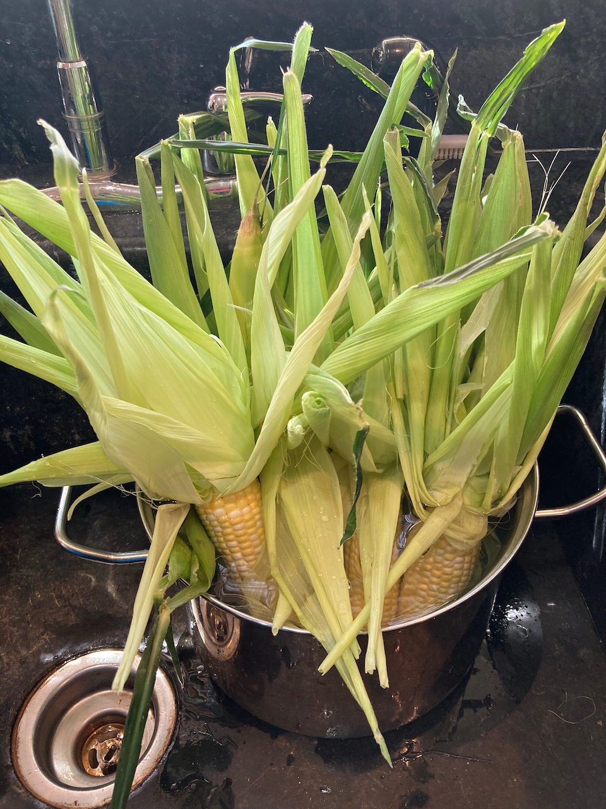
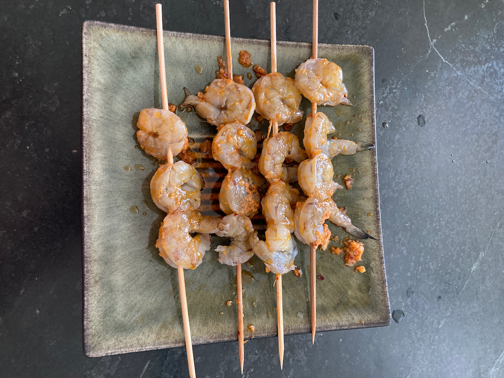
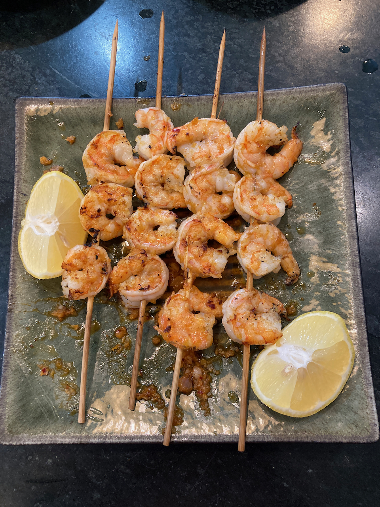
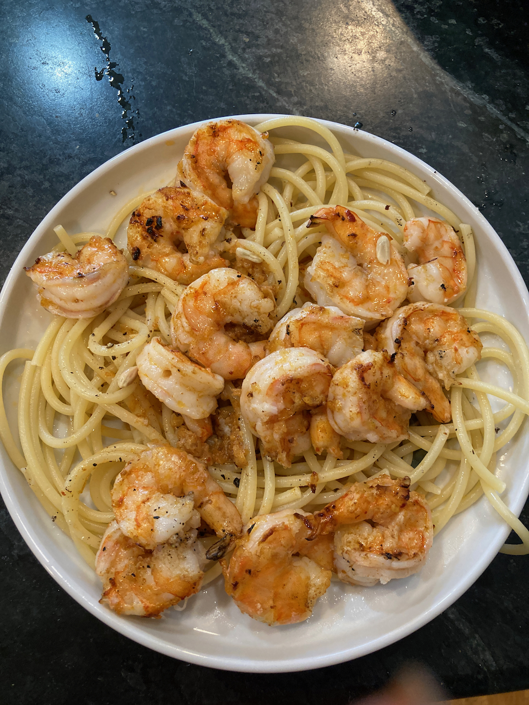

# Grilling and Barbecuing {#bge}

As I mentioned earlier, I am a Big Green Egg addict. So what is it? A more generic name is a komodo cooker - a heavy duty ceramic charcoal cooker, shaped like the ubiquitous Weber Cooker, but much heavier and more expensive. If your budget can afford it, I recommend spending the bucks for an Egg, especially if you anticipate doing a lot of low temperature barbecuing. It is much easier to control the temperature than in a Weber-style device, and a load of charcoal goes a lot longer (an 18 hour barbecue of pork butt or brisket can be completed on a single generous charcoal load). Also, with proper handling, one will last forever, so that while the upfront costs are a challenge, over time you may end up saving money - in my prior life, I found that metal cookers had a lifespan of something like 3-5 years.

With respect to what size to get, I strongly recommend the large (original) Egg. As I mentioned earlier, we started with a medium (recommended for cooking for 2) but quickly found it to be overly constraining - I could barely fit four ears of [corn on the cob](#corn) into it. Furthermore, you can forget grilling multiple different items at the same time.

> Note that there is an extra large model, which is huge. If you have a big family or are a grilling fanatic, you might want to consider it, but is is far larger than anything I can foresee ever needing.

Finally, don't look for a bargain online. They are sold only through authorized dealers. By buying from one, your Egg will come with a lifetime guarantee on the ceramic parts,

## Charcoal and Lighting

There are two cardinal rules regarding what to use in a Green Egg:

1.  **NEVER use lighter fluid. It will soak into the ceramic and ruin your investment.**
2.  **Only use lump charcoal, not briquets, essentially for the same reason, but also to improve the flavor of just about everything.**

The instructions for you Egg will recommend that you only use "genuine Big Green Egg Charcoal". Ignore that advice. Yes, BGE charcoal is high quality, but a) it is expensive, and b) it may be hard to find. I have been using supermarket-branded lump charcoal for years and have found it to be quite satisfactory.

With respect to lighting, most sources recommend using a chimney, in which you mix some charcoal and some paper. The paper is ignited, and when the charcoal is burning, the chimney is removed and more charcoal is added as needed. I'll be honest - I've never tried this. Rather, I load the charcoal into the egg, insert 2-3 paraffin-saturated composite sticks into it, and then ignite them. With this method, I reliably get a nice bed of hot coals in 10-15 minutes.

## Accessories

### The Basics

For grilling, it certainly is possible to use your new Big Green Egg "out of the box", however a number of accessories, from the mundane to the sophisticated (and of course from cheap to expensive) help to greatly expand your grilling and barbecuing repertoire. Here are a few I find to be invaluable:

1.  An **ash tool**, something you should order when you purchase your Egg. It is absolutely necessary for removing ashes from the Egg through the lower vent.\
2.  A **garden trowel**, which facilitates arranging the charcoal once it is in the egg.
3.  A [**ConvEGGctor**](https://biggreenegg.com/product/conveggtor/). I hate the name, but it's a great device if you want to use your egg more like an oven than a grill. I routinely use it with brisket and smoked pork, and also for bread, which I occasionally cook in the Egg.

There is, of course, a bunch of other stuff you will want to have, such as a grill brush, standard grilling tools, and some heavy duty oven mitts, but those are largely items of personal preference. I'll now turn to the the critical issue of temperature control.

### Temperature Control

One of the great advantages of the Big Green Egg is that, with a little practice, you can control the temperature when the lid is closed (which for me is most of the time. The question is how. They come with a dome thermometer, but they are notoriously inaccurate. So what to use in its place?

There are two temperatures that really matter, especially when barbecuing. The first is the **grill temperature**; the second is the **internal temperature** of what you are cooking. And because you don't want to be opening and closing the lid any more than necessary, it is valuable to have a **remote monitoring system** for both.

> Big Green Eggs come with a dome thermometer, but they are notoriously inaccurate. I ignore it most of the time.

For all matters of temperature and time, I am a big fan of [Thermoworks](https://www.thermoworks.com/). Not only do they make high quality devices, but their website is an excellent source of recipes, ones we will be referring to frequently. If you sign up for their newsletter, you will receive only one email a day. Some of them are purely promotional, but others contain links to recipes you may want to explore. These are their devices I've used over the past decade or so, ranging from the most basic to the most elaborate.

1.  [The ChefAlarm Thermometer and Timer](https://www.thermoworks.com/chefalarm/) was my first device, and it is very useful for indoor cooking. It will monitor a single temperature and has both time monitoring and high and low temperature alarms. It comes with a single probe for monitoring internal temperatures, meaning that it can't be used to monitor both internal and grill temperatures. In addition, it does not have remote monitoring (Bluetooth or WiFi) capabilities.\
2.  If you don't go with the previous device, you will need a **standalone timer**. While Thermoworks is in the business of selling temperature controlled devices, it also offers an excellent selection of time monitoring devices. My personal favorite is [the Extra Big and Loud Timer](https://www.thermoworks.com/extra-big-loud/) - it is very simple and straightforward to use. Of course all kinds of timers can be had at grocery stores, kitchen stores, etc., so if you already have one of those (or wish to save money by buying one) that is a perfectly fine option.
3.  I strongly recommend an **instant read thermometer**. If you have an internal monitoring device, it only reads the temperature in one spot; other spots in the item cooking may be hotter or cooler. The best device on the market right now is the [Thermopen One](https://www.thermoworks.com/thermapen-one/), which has a one second response time. The [Classic Thermopen](https://www.thermoworks.com/classic-thermapen/) is also a fine option, having a response time of 2-3 seconds, and which is about \$20 less expensive.
4.  Now we get into the heavy duty stuff - **multiple channel devices with remote monitoring capabilities**. I've already addressed why multiple channel monitoring is important (for both grill and internal monitoring); we sometimes can use one or two additional channels (such as grilling or barbecuing poultry, where keeping track of both thigh and breast temperatures are important). Thermoworks has two options to be considered. The first is the [Smoke](https://www.thermoworks.com/search.php?search_query=smoke) series of devices. The most inexpensive (\$99 at time of writing) has two channels and basic blutetooth capabilities, and comes with one internal and one grill temperature probe. Moving up in sophistication (and price) are the Smoke X2 and Smoke X4, both of which use longer distance RF transmission and have 2 and 4 channels respectively. But the absolute best (and what I use exclusively) is the [Signals](https://www.thermoworks.com/signals/) bluetooth and wifi device. It can be controlled by a reasonably functional smart phone app, and with it connected to your WiFi network, you can actually monitor temperatures from anywhere in the world. That may seem silly, but when you're doing a 16 hour barbecue of a brisket or a pork butt, that may prove to be useful - you will not be tied to your home for the duration. Indeed, when you use a temperature control device (see below) you can actually make adjustments to the cooking temperature from afar.
5.  Of course, **probes** are an essential part of any temperature monitoring system. All of the above devices come with an adequate selection of probes, but there are a large number of different ones available. One I use a lot is a [High Temperature Needle Probe](https://www.thermoworks.com/tx-1015x-n2/), which is shorter, making it ideal for monitoring small or thin items like chicken wings or fish. Also, although I was skeptical at first, I have found [Probe Spools](https://www.thermoworks.com/silicone-probe-spool/) to be an incredible convenience. They all but eliminate tangling and kinking, things that can greatly reduce probe lifetimes.
6.  So far we've dealt with temperature monitoring, but what about **Temperature Control**? We are now at the ultimate high end of sophistication. The device for doing so is the [Billows Temperature Control Fan](https://www.thermoworks.com/billows/), a fan that attaches to the lower vent of a barbecue device and, in combination with a Smoke or a Signals device, does its best to control the chamber temperature. I always use it for low temperature cooking, and if I do so carefully, it is a godsend. BUT, two caveats:
    -   It requires electricity. I am fortunate enough to have an outdoor plug near my outdoor cooking area, but if you don't, you'll have to either rig up extension cords from the nearest outlet or spring for [a 12 Volt Battery Pack](https://www.thermoworks.com/billows-12v-battery-bank/), which actually costs more than the device itself (\$99 vs. \$79).\
    -   It is really good for bring your grill up to temperature, but it is largely ineffective in bringing it down. Thus, if you're doing a low temperature cook, it is critical that you get it attached, set, and running well before the chamber has reached your desired temperature.
7.  Finally, how to store all this mess? While it's not, in my opinion, Thermoworks' finest product, their [Extra Large Zippered Storage Case](https://www.thermoworks.com/tx-1017x-c2/) will hold all of my devices (which, just to review, are a Big and Loud Timer, a Thermopen, a Signals monitoring unit, a Billows control unit, and four probes on spools). I've also managed to add some metal skewers that I use on occasion.

{width="70%"}

Big Green Egg with Billows and Signals attached.

{width="40%"}  {width="40%"}

Screen shots of Thermoworks app display. Left: Readings screen, showing internal temperature (top) and grill temperature (bottom) at the beginning of a run. Right: Graph screen after one hour of cooking a tritip roast. Grill temperature is in green and internal temperature is in gold.

{width="70%"}

My temperature monitoring and control kit. Clockwise from top: Skewers, wiring for Billows, Billows device, Thermopen, Signals controller, Big and Loud timer.

## Grilling {#grill}

### Chicken

Chicken is, of course, incredibly versatile, and like pork or beef, it can benefit from low temperature cooking (see recipes in the [Barbecue](#bbq) section. But sometimes, you may want to cook up some chicken pieces for a quick dinner. As with most chicken recipes, I greatly prefer thighs - they are much more forgiving, in that unlike white meat, they don't dry out if they are cooked to too high a temperature. Here's a very basic but versatile recipe.

##Ingredients##

> Four bone-in chicken thighs\
> olive oil\
> kosher salt\
> milled black pepper\
> \~1/2 cup your favorite barbecue sauce

1.  Light your grill and heat it to 450^o^ F.\
2.  Rub the surface of the chicken pieces with the olive oil and sprinkle with salt and pepper.\
3.  Grill the chicken for \~15 minutes, turning every 3-4 minutes.
4.  Brush both sides of the chicken with barbecue sauce and return to the grill.
5.  After 2 minutes, brush the chicken with more barbecue sauce, flip, and brush the second side as well.
6.  Repeat this process 1-2 more times, until the barbecue sauce is gone and/or the internal temperature of the thighs has reached 170^o^ F. (155^o^ for white meat).

Note that this recipe goes very well with the next recipe for corn on the cob. If you choose to do both, grill the chicken first, put it in a foil-covered bowl, and then grill the corn.

### Corn on the cob {#corn}

I am fortunate enough to have grown up in sweet corn country. Indeed, one of my fondest childhood memories is, when we were visiting family friends on a farm in Macedon NY, the children (including me) were sent out in the field to pick fresh corn for the day's dinner. From the field to the pot in 10 minutes - absolutely delicious! Unfortunately, I then spent a big chunk of my life in Florida, and corn there simply doesn't measure up to what I grew up with. Thus, it was absolutely wonder to discover, when I moved to Ohio in July of 2007 (peak corn season) that the corn here measures up to what I remember as a child.

So the first secret about corn on the cob is freshness. Ideally, it should be cooked the day it is picked; with storage, even refrigerated, the sugar in the corn rapidly turns to starch. I have eaten second day corn, which is satisfactory, but fresher is better.

So here's my method for cooking corn on the grill. I'm not sure where I got the original recipe, but it's pretty basic and ubiquitous.

**Ingredients**

> 2-6 ears of fresh sweet corn, in husks\
> melted butter\
> fresh ground pepper\
> grated parmesan (optional)\
> butcher twine

1.  Peel the husks back (do NOT remove them) and discard silks.
2.  Place corn into a large kettle of water and let soak for at least an hour.
3.  Remove the corn from the water, baste with melted butter, and sprinkle with pepper, Parmesan (if desired) and any other flavors you might like (dill is a popular one). A half a stick of butter is sufficient for four ears.
4.  Cut one \~8 inch piece of twine for each ear. Wet them in water to make them easier to tie.
5.  Fold the husks up over the corn and tie together with twine.
6.  Place the corn on your grill preheated to 450^o^ and roast a total of 10 minutes, rotating the ears every 2.5 minutes.
7.  Remove ears from grill. With neoprene mitts on, grasp the ear with one hand and the stem with the other. Snap vigorously and separate the stem and attached husk from the ear of corn (you may want to cut the twine with scissors first).
8.  Serve with just about anything.

{width="50%"}

Four ears of corn soaking with the husks pulled back and the silks removed.

{width="50%"}

Corn prepared as described and half way through grilling

{width="50%"}

Grilling is complete

{width="50%"}

Ready to eat

{width="50%"}

Ready for the compost pile.

### Fajitas

This recipe was originally one designed for the Instant Pot, but it is really easy to prepare it on a grill. It can also be prepared on the stove top, substituting a heavy frying pan for the grill basket.

**Ingredients**

> \~3/4 lb beef, sliced into strips for stir fry (flank steak works well)\
> 2 tbsp fajita seasoning\*\
> 1 bell pepper\
> 1 onion\
> Splash of red wine\
> 1 lime, cut into wedges\
> Flour tortillas

2.  Coat the beef with a tablespoon of fajita seasoning and the splash of red wine. Marinate for 30 min to an hour.
3.  Slice the vegetables and add the remaining seasoning.
4.  Place the meat in a grill basket and cook over a medium hot (450^o^ F.) grill until browned, about 3-5 minutes. Remove and set aside.
5.  Add the vegetables to the basket and cook for about 10 minutes, until vegetables are cooked through.
6.  Add the meat to the mixture and cook for another 5-10 minutes.
7.  In your kitchen, briefly warm the tortillas eitheron a frying pan over medium heat or by toasting briefly (1-2 minutes) in a toaster oven. Place in a basket and cover with a kitchen towel.
8.  Serve the tortillas, filling and lime wedges for people to put together for guests to serve themselves. If desired, add your favorite hot sauce and/or sour cream (not my favorite).

\*There are plenty good choices of fajita seasonings out there. If you choose to make your own, here is the [recipe that I use](https://littlesunnykitchen.com/fajita-seasoning/). 

> 2 tbsp chili powder  
4 tbsp ground cumin  
2 tsp smoked paprika  
4 tbsp garlic powder  
2 tsp onion powder  
2 tsp cayenne pepper  
2 tsp oregano  
1 tsp black pepper  
1 tsp salt  

Mix everything together and store in an air tight container. Paprika, cayenne, and salt amounts can  be adjusted to taste.

If you are an instant pot user, you can find the original recipe [here](https://www.theinstantpottable.com/instant-pot-steak-fajitas/).

### Korean Chicken Skewers

This is a recipe from [*Southern Living*](https://www.southernliving.com/recipes/honey-butter-chicken-skewers) and is absolutely delicious and pretty easy to prepare. I cook these on metal skewers that are about 12 inches long and have a flat shape, so that the skewered food is easier to handle.

**Ingredients**

> 1/2 cup unsalted butter\
> 2 garlic cloves, peeled and grated\
> 1/3 cup honey 1 tsp kosher salt 1 tsp rice vinegar\
> 2 lb boneless skinless thighs, cut into 1 inch cubes\
> 1 large red onion, cut into wedges

1.  Prepare your grill for direct cooking at 450^o^ F.
2.  Melt the butter on the stovetop over medium low heat.\
3.  Add the garlic and cook for about two minutes.
4.  Add the salt, vinegar and 2 Tbsp soy sauce, bring to a boil, and cook for about 2 minutes.\
5.  Toss the chicken with the remaining soy sauce.
6.  Thread the chicken and onion wedges onto skewers, adding two pieces of chicken followed by one onion wedge.
7.  Grill, basting often with honey butter mixture, for 10-12 minutes until chicken is light charred and cooked (if you want to check with an instant read thermometer, the internal temperature of the chicken should be \~165^o^.
8.  Serve over rice or bucatini.

### Grilled Shrimp

I agree with Bubba in *Forrest Gump* - you can do just about anything with shrimp. Furthermore, they can be cooked easily and rapidly (the big danger is overcooking). As for grilling, there are lots of possibilities - [allrecipes.com](https://www.allrecipes.com/gallery/best-grilled-shrimp-recipes/) provides 18 recipes for doing so. Here's the one I've settled on.

**Ingredients**

> 1/2 cup butter 1 shallot, minced\
> 4 cloves garlic, peeled and minced\
> 1/4 tsp red pepper\
> 1 tsp. paprika\
> 0.5-1 lb. large (16/20) shrimp, peeled and deveined\
> 1 lemon, quartered

1.  Light your grill and bring it to about 450^o^ F.
2.  Soak 3-6 wooden skewers in water for at least 20 minutes
3.  Melt the butter over low heat.
4.  Add the shallot, garlic, paprika and red pepper. Simmer 2 minutes
5.  Place the shrimp on skewers (3-4 shrimp on each) and brush liberally with the butter mixture.
6.  Grill for a total of four minutes, surning once. The shimp should now have a pinkish tinge.
7.  Serve over pasta, with any remaining butter mix mixed in. Squeeze 2 lemon quarters over each serving.

{width="40%"} {width="40%"}

Shrimp on skewers, before and after grilling

{width="80%"}

Ready to eat.

## Barbecuing {#bbq}

### Some Basics

### Beef and Pork

#### [Brisket Style Tritip](https://blog.thermoworks.com/beef/brisket-style-tri-tip/) {#tritip}

This is a great place to start in your barbecue adventure. Unlike a brisket, it is a small piece of meat, more suitable for 1-2 people (although it will yield up multuple servings. Furthermore, the cook time is reasonable (6-7 hours), and leftovers will keep in the refrigerator for days.

Ingredients:

> 2-3 pound Tri-tip roast\
> Your favorite beef barbecue rub (I use [Penzey's Barbecue 3000](https://www.penzeys.com/online-catalog/bbq-3000/c-24/p-327/pd-s)\
> 3-4 Oak or Hickory Wood Chunks\
> Orange Butcher paper (available at [Lowes](http://www.lowes.com))

1.  Soak the wood chunks in water for at least 30 minutes.
2.  Load the barbecue with charcoal and add two Fire Starter Sticks. Ignite.
3.  As soon as the flame dies down, add the soaked wood chips and stir them into the coals as best you can.
4.  Place your ConvEGGtor, and aluminum drip pan, and grill in place
5.  *Immediately* hook up your Billows device with a long probe in channel 1 and your grill monitoring probe (attached to the grill).\
6.  Using the Thermoworks app, set the fan temperature to 250^o^ F. Close the upper vent on the Egg nearly completely
7.  Apply a binder to the tri-tip. Mustard is the standard here, however I use olive oil.
8.  Apply rub liberally to all sides
9.  Insert a long probe into the heart of the roast and place on grill. Close the lid and let the cooking commence.

{width="40%"} {width="40%"}

Left: Beginning the barbecue Right: Tritip wrapped in butcher paper for final cook.

At this point, sit back, have a beer or a glass of wine, and keep an eye on time and temperature. When the internal temperature reaches 150^o^ F. or when 2 hours have past (whichever comes first), proceed as follows:

1.  Remove the roast from the Egg, keeping lid-open time to a minimum.
2.  Wrap the roast in two layers of orange butcher paper.
3.  Return the roast to the Egg, and with the app, increase the grill temperature to 275^o^ F.
4.  When the roast has reached 200^o^ F. (about 3-4 hours), remove it and let it stand wrapped for 20 minutes or so.
5.  Slice and enjoy!

{width="40%"}  {width="40%"}

Cooked and sliced.

#### Roast beef for sandwiches

This is one that showed up in my inbox from [Thermoworks](https://blog.thermoworks.com/blog/homemade-deli-style-roast-beef/). I haven't tried it yet, but I'm betting it will work well barbecued on the grill. Note that the original recipe calls for a preliminary sear; I'm betting that smoking without the convEGGtor will get the job done.

**Ingredients**

> 1 eye round roast, 2-3 lb\
> kosher salt\
> black pepper

1.  The night before you cook, salt the roast generously and place in the refrigerator covered.
2.  Prepare your grill for low temperature smoking at 200^o^. You may or may not want to add wood chunks (oak or hickory).
3.  Rinse off excess salt, dry, and apply pepper.
4.  Barbecue at 200^o^ F until internal temperature reaches 120-130^o^ F. (lower for more rare meat, higher for more tender).
5.  Use your instant read thermometer to check for doneness.
6.  For ease of slicing, put roast in the refrigerator overnight.

#### Pork ribs

There are, of course, a variety of cuts of ribs out there - we will concentrate on "St. Louis" ribs, cooked "wet" (that is, finished with barbecue sauce).  Because ribs are high in connective tissue, they need to be cook to a high enough internal temperature for the tough collagen to be converted to gelatin.  We also have to overcome the "stall", when at about 160^o^ F. water is release from the meat and slow the temperature increase as a result of evaporative cooling.

The following so-called [3-2-1 cooking](https://heygrillhey.com/3-2-1-ribs-perfect-fall-off-the-bone-ribs/#wprm-recipe-container-3457) is from Hey Grill Hey, and works rather well.  A rack of ribs can be ready to eat in about 6-7 hours.

**Ingredients**

>1 rack of ribs  
2 tbsp pork rub  
1 cup apple cider or juice  
1/4 cup dark brown sugar  
2-3 tbsp butter  
1/2 cup your favorite barbecue sauce*

* While I normally like hot sauces, in this case a milder tomato-based sauce works better.

1.  Prepare your barbecue for smoking (using the convEGGtor) with hickory wood chunks at ~200 ^o^ F.
1.  Pat the ribs dry and attempt to remove the membrane from the back by grasping with a paper towel and pulling.  Don't worry if you don't get all of it - the ribs will still be fine.
2.  Liberally dust both sides of the rib with your favorite rub.
3.  Place the ribs on the grill, with an internal temperature probe in place, and grill for about 3 hours. The internal temperature should reach ~160^o^ F.
4.  Place a sheet of heavy duty aluminum foil on your work surface and transfer the ribs to it, bone side up.
5.  Sprinkle the ribs with brown sugar, and distribute the butter as multiple pats on the surface.  Raise the sides of the aluminum foil to form a boat and add the apple cider or juice.
6.  Wrap the foil tightly around the ribs, reinsert the internal temperature probe, and return to the barbecue.  Maintain at 225 ^o^ F. for two hours.
7.  Unwrap the ribs and baste them on both sides with barbecue sauce.  Continue cooking for one hour, flipping and basting occasionally.  The final internal temperature should be 200-205^o^ F.
#### [Pig Wings](https://blog.thermoworks.com/bbq-grilling/pig-wings/)

Despite the fact that we live near Cincinnati, home of the Flying Pig Marathon, these are not made from avian porcines. Rather, they are partially deboned and trimmed pork shanks, prepared with a sauce similar to traditional buffalo wing sauce. The meat may be available from a local butcher shop; online it can be had at [Porter Road](https://porterroad.com/) in Nashville (a great source of meat, but expensive, with high shipping costs). Alternatively, you may be able to get properly trimmed pork shanks from your local butcher shop.

Like brisket or pork butt, shanks are full of connective tissue that must be broken down in order to yield a properly tender result. This will occur if the meat is cooked to an internal temperature of 200^o^ F. That processed is hastened by covering the pan containing "wings" and sauce for the second half of the cooking.

*Ingredients*

> Pig wings (however many you want)\
> BBQ rub\
> 1 onion, sliced or diced.\
> 8 oz. butter\
> 8 oz. hot sauce (your favorite)\
> Juice of half a lemon\
> 1 tbsp. mustard powder\
> 1/2 cup apple cider vinegar\
> 12 oz. beer

1.  Prepare your smoker as you did for [tri-tip](#tritip). For this recipe, you want to reach a cooking temperature of 250^o^ F. Hickory or apple wood work well for this recipe.\
2.  Remove any excess fat and the silver skin (if any) from the wings.
3.  Season with BBQ rub (or with salt, pepper and garlic powder).
4.  Place in the smoker and cook for 1 hour, turning every 20 minutes.
5.  While the wings are smoking, make the sauce as follows:
    a.  Melt the butter, add the onion, and sauté until soft.\
    b.  Add all of the remaining ingredients EXCEPT the beer and let it boil for a couple of minutes.\
    c.  Add the beer and boil for an additional 5 minutes.
6.  After the hour of cooking above, mop the wings with the sauce. Continue to cook for an additional hour or until the internal temperature reaches 180^o^, mopping every 20 minutes or so.
7.  Transfer the wings to an aluminum pan with \~1/2 inch of sauce in it. Top the wings with some of the onions from the sauce.
8.  Cover the pan with foil, insert an internal temperature probe into one of the wings through the foil.
9.  Cook until the internal temperature reaches 200^o^. Verify with your instant read thermometer.
10. Allow wings to rest 10-15 minutes and then serve.

### Poultry

#### Chicken Wings

What's not to love about chicken wings? Aside from the fact that they are messy to eat, they are very tasty, either by themselves or (as is more common) dipped in one of many different wing sauces. Of course, wings are often broiled or fried, but I have found that slow cooking on the barbecue works very well. My preference is for wings that have been sectioned prior to cooking, but that is not necessary if you prefer keeping them whole.

**Ingredients**

> 2 lb. chicken wings\
> barbecue seasoning of choice (salt and pepper would also work)\
> 4 oz. hot sauce,\*\
> 3 tbsp. butter

1.  Prepare your grill for smoking at 220^o^F. I do not use wood chunks for this - the charcoal imparts plenty of flavor.
2.  Pat the wings dry with paper towels, and if sectioning, use game shears to separate the tips, flats, and drumettes. Discard the tips (or save them for making stock).
3.  Liberally apply rub.
4.  Place the wings on the grill, with a short needle probe inserted into the largest piece. If you have a grilling rack (see photo below), use it.
5.  When the internal temperature reaches 125^o^ F., turn the wings over.
6.  While they are continuing to cook, melt the butter and stir in the hot sauce.
7.  When the internal temperature reaches 165^o^, remove the wings, stir in with the hot sauce mix, and serve.

\* Given my western New York heritage, I am partial to Buffalo style wings. Of course there are hundreds of commercial sauces available; I actually use one I get from an Amish market in Adams County Ohio. A more widely available alternative is [Tabasco Bufalo Style Hot Sauce](https://www.tabasco.com/hot-sauces/buffalo-style-hot-sauce/). Alternatively there are lots of recipes for making your own, either Buffalo style or your favorite alternative. One that I like is [Korean barbecue ribs](https://www.tabasco.com/hot-sauces/buffalo-style-hot-sauce/) published recently in *Southern Living*:

> 1/2 cup gochujang (available in the Asian section of most food stores or at specialty markets)\
> 2 tbsp sesame oil\
> 2 tbsp honey\
> 1 tbsp peeled and grated ginger\
> 3 cloves garlic, peeled and chopped chopped scallions\
> toasted sesame seeds

The recipe given calls for the wings to be marinated in the first five ingredients for an hour, after which they are cooked as described above. I'm sure this mix would also work if the wings were to be dipped in it after cooking rather than before. Either way, the scallions and sesame seeds are sprinkled on the cooked wings before serving.

\newpage

#### Margarita Brined Chicken

This recipe was originally published in [*Southern Living*](https://www.myrecipes.com/recipe/margarita-brined-chicken) and called for high temperature grilling. However, I found that low temperature direct grilling works extremely well. As always, I use thighs, but if you are using breast meat, simply change the pull temperature from 170^o^ to 155^o^ F. And it's a great recipe to prepare for company - while on the grill it requires very little attention, so you can mingle with your friends instead of being chained to the grill.

**Ingredients**

> 1 cup water\
> ¼ cup kosher salt\
> 2 tablespoons light brown sugar\
> 1 cup cold water\
> ½ cup tequila\
> 3 tablespoons orange zest\
> ½ cup fresh orange juice\
> 3 tablespoons lime zest\
> 1 tablespoon whole black peppercorns\
> 6 bone-in chicken pieces (thighs, drumsticks or breast halves)\
> 2 tablespoons olive oil\
> teaspoon kosher salt\
> ½ teaspoon freshly ground black pepper\
> 6 limes, halved\
> Fresh cilantro for garnish

1.  Add water, salt and brown sugar to a saucepan and bring to a boil, stirring regularly until the sugar and salt are dissolved.\
2.  Pour the mixture into a large bowl, let stand 10 minutes, and then add cold water, tequila, orange zest, orange juice, lime zest and black peppercorns to it.
3.  Submerge the chicken in the brine mixture, cover the bowl, and let it marinate refrigerated at least 6 hours or overnight.
4.  Set up your grill for low temperature cooking at 230^o^ F.
5.  Remove the chicken and pat it dry. Discard the brine mixture.
6.  Brush with olive oil and sprinkle with salt and pepper. Let the chicken stand at room temperature for 20 minutes.
7.  Place the chicken on the grill, with a temperature monitoring probe placed in the largest of the pieces.
8.  Grill, turning occasionally until the internal temperatures reach 155^o^ F. for white meat or 170 ^o^ F. for dark meat.
9.  For the last 5 or so minutes, grill the lime halves, cut side down.
10. Place the chicken on a platter, cut the lime halves in two and place on the platter. Garnish with fresh cilantro.

#### Smoked Duck

I really like duck, mainly because it is all dark meat. Not only does that (at least to me) taste better, but also cooking is a bit easier than chicken, in that the bird has a single pull temperature (160^o^ F.) The downside, however, is that duck contains LOTS of fat, that needs to be rendered. Also, don't count on more than two servings per bird.

**Ingredients**

> 1.5-2 lb. duck\
> 1/3 cup kosher salt\
> 2 small oranges, halved\
> 1/2 cup orange juice\
> 1/2 cup maple syrup

1.  The night before cooking, pierce the duck all over with the sharp end of a skewer or temperature probe, taking care not to penetrate the meat.
2.  Apply the kosher salt to the surface of the meat and refrigerate for \~15 hours.
3.  Set up your grill, using soaked maple wood and the convEGGtor, with a target temperature of 275^o^ F. **Do not forget to put in a drip pan**.
4.  Remove the duck from the refrigerator, wipe off the salt, and pat it dry.
5.  Fill the duck cavity with orange halves.
6.  Prepare basting liquid by combining orange juice and maple syrup.
7.  Smoke the duck, basting occasionally, until it reaches an internal temperature of 160^o^ F.
8.  At this point, I usually find that the duck is ready to eat. If so, remove it from the grill, let it stand 15 minutes, and carve. If you want, drizzle the meat with any remaining basting liquid.
9.  If, after reaching temperature, the duck is not sufficiently crisp and/or the fat is not completely rendered, transfer it to your oven and broil for 2-3 minutes.

#### Smoked Spatchcocked Turkey

What can be more traditional than turkey with the trimmings for Thanksgiving? As a child and as a younger adult, I had it on almost a yearly basis. Now, I only do it on the rare occasions that we have company - otherwise, I get to eat all of it myself, and leftovers do get old!

Smoke certainly adds a nice touch to the turkey, and slow cooking helps to keep the meat moist (as does dry brining the bird). The challenge is in reaching two different pull temperatures - 150^o^ F. for white meat and 170^o^ for dark. This is where spatchcocking - removing the backbone and pressing the bird as flat as possible - comes into play. Doing so allows heat to penetrate the bird more evenly, so that it is easier to reach a uniform pull temperature. Of course, by doing so you lose the ability to make a grand entrance into the dining room with a golden brown bird, but what is more important, image or substance?

The recipe below can be found on [seriouseats.com](https://www.seriouseats.com/spice-rubbed-butterflied-smoked-turkey-food-lab-recipe). It is optimized for a standard kettle cooker, so if that's what you have, you should follow their grilling instructions. For Big Green Egg cooking, we'll make a couple of changes:

-   Of course we'll use lump charcoal, not briquets, as was recommended.\
-   In place of indirect cooking, we'll use our convEGGtor.
- The original recipe calls for adding additional wood to the coals as the turkey cooks.  This is, of course, very difficult to do with a convEGGtor in place, and quite frankly can result in a turkey that tastes more like wood smoke than anything else.  Four chunks, well mixed into the coals, will provide smoke for about 2 hours, more than enough to flavor the bird sufficiently.

I also strongly recommend fresh turkey if available (I've gotten mine straight off the farm). The meat will be juicier, and if you can find it from a local farm, you will be supporting their business. I usually shoot for a 14 pound bird - smaller ones tend to dry out and larger ones are suitable only for very large families or get-togethers.

**Ingredients**

> 1 12- to 16-pound turkey\
> 2 tablespoons (35g) kosher salt\
> 1 tablespoon olive oil\
> 1 tablespoon paprika\
> 1 teaspoon smoked paprika\
> 1/2 teaspoon freshly ground black pepper\
> 1/2 teaspoon ground yellow mustard seeds\
> 1/2 teaspoon ground coriander seeds\
> 1/2 teaspoon ground cumin seeds\
> 1/4 teaspoon ground cayenne pepper\
> 1 teaspoon granulated garlic powder\
> 1 teaspoon granulated onion powder\
> 1 teaspoon ground sage\
> 2 tablespoons (40g) light brown sugar\
> 1 tablespoon baking powder  

*Preparing and dry-brining*

1.  1-3 days before cooking, remove the turkey's backbone by cutting on either side of it with either poultry shears, a cleaver, or a heavy carving knife.
2.  Remove the wishbone with a paring knife and discard.  Place the bird on a flat surface and press hard on the breast to crack the bone and flatten the bird.
3.  Rub the surface of the bird with olive oil.
4.  Mix all of the remaining ingredients (the spices) together and rub over the entire surface of the turkey.  Refrigerate, covered, at least overnight and up to three days.

*Barbecuing*

1.  Prepare your grill for cooking with the convEGGtor in place, adding soaked hickory chunks and setting a smoking temperature of ~250^o^ F.
2.  Place internal temperature probes into the breast and the thickest part of a thigh of the turkey.
3.  Place on the grill, legs pointing down, and cook until the breast temperature reaches 150^o^ and the thigh one 165^o^ F.  This will take around three hours.
4.  Remove from the grill, let it rest 15 minutes, and carve.

### Fish

#### Smoked Salmon

Salmon is probably the most widely consumed fish in America today. In truth, however, it is not exactly my favorite. EXCEPT when it is fresh caught pacific salmon (as in at a dockside restaurant in Seattle) or it is smoked Pacific salmon (I've never tried smoking Atlantic varieties). These include sockeye (the most commonly found), coho, and (for a luxury treat) king salmon. A few years ago I ventured forth on smoking my own, and actually came up with a recipe that drew rave reviews at a party, including from my old friend Lee, who is an avid fisherman and pretty much a go to expert on cooking fish.

A couple of points before we begin. First, this is one place in which the wood used for smoking really matters. And alder is definitely the way to go. It may be a bit hard to find, but it is worth the hunt.

Second, the overnight dry brining is critical. The spices in the brine add some flavor, but what is most important is that the salt acts to dehydrate the fish and remove some of the more unpleasant fishy flavor.

Finally, temperature control here is tricky. The grill temperature used, 160^o^ F., is the lowest of any we use in this book. A few tips may help:

-   Keep the amount of charcoal and wood to a minimum.
-   Just as soon as the flame from the starter dies down, add the smoking wood and set up your Billows device set to 160^o^ F. If you do not have one, turn both vents down to the smallest possible openings.
-   Even if the grill temperature does drift upwards, as long as you monitor the internal temperature and pull the fish when it hits 125^o^ F., you will have an excellent piece of fish to share with friends.

Note that I have only used this for Pacific Salmon, which tends to be more expensive than Atlantic salmon and is sometimes hard to find. Some day I'll smoke a piece of Atlantic fish just to see how it turns out.

This recipe comes from [Delishably](https://delishably.com/meat-dishes/Smoked-Salmon-on-the-Big-Green-Egg-Kamado-Smoking) and is optimized for Big Green Egg cooking.  My only bone to pick with the recipe is the pull temperature - they recommend 160^o^ F.; to me, that makes the fish overly dry and, if anything, too flaky.  

**Ingredients**

> 1 pacific salmon filet, 1-1.5 lb.\
> 1 cup brown sugar\
> 1/2 cup Kosher salt\
> 2 cloves garlic, chopped\
> 1 tsp grated ginger\
> 1/2 tsp ground black pepper\
> 2 bay leaves, crumbled

1.  Pat the fish dry and place it in a glass baking dish.
2.  Combine the remaining ingredients and apply them to both sides of the fish.
3.  Cover the dish with aluminum foil and refrigerate overnight.
4.  The next morning, remove the fish from the pan and rinse very thoroughly.
5.  Pat it dry and return it to the refrigerator for about an hour.
6.  About 45 minutes after you return the fish to the refrigerator, prepare your grill for smoking, with the convEGGector in place. You will want to place an aluminum drip pan on its surface.
7.  When the coals are going and the wood added, insert a needle probe into the fish and place it on the grill. Close the grill and leave it closed! There is no need to do anything to the fish while it is smoking.
8.  When the internal temperature reaches 125^o^ F., remove the fish to a platter and let it cool.

This is, of course, best served as an appetizer with some sort of lightly salted and flavored crackers. It will keep in the refrigerator for at least a week.
