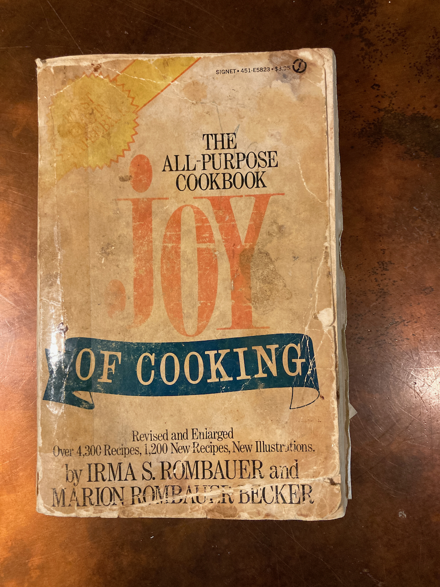

# References {#References}

## Books

In my opinion, nothing beats a good old fashioned cookbook. I can leaf through the pages or use the index to find new ideas, and newer ones tend to be well illustrated, a definite plus. Having said that, I tend to rely on my old collection, some of them going back to my childhood, rather than rush out to grab the newest one on the market. These are a few of those that have been well used in our kitchen.

### General Cooking

What could be a more classic place to start than Irma Rombauer's *The Joy of Cooking*. Originally published in 1931, it has since been, revised repeatedly, and authorship now includes three of her descendants - Marion Rombauer Becker, Ethan Becker, John Becker, and John's wife Megan Scott (most recent edition published by Scribnerin 2019). Irma died in 1962; my copy is one of the first editions (1964) published after her death and authored by her daughter Marion. As you can see, it has gotten a lot of use.

{width="40%"}

### Bread

My first recommendation, of course is Peter Reinhart's *Artisan Breads Every Day* (Crown Publishing Group, New York: 2009). It will guide you step by step through the fundamentals of wild yeast fermentation and contains an excellent set of recipes using both sourdough and yeast as leavening.

Once your sourdough passion is aroused and you are comfortable with making, for example, [Pan au Levain]{#pal}, then it's time to move onto Chad Robertson's *Tartine Bread* (Chronicle Books, San Francisco: 2010).

With respect to more classic cookbooks, I still use Dolores Casella's *A World of Bread* (David White Company, New York: 1966) on occasion. It includes much more than just yeast-risen breads - for example it has an excellent recipe for sourdough waffles (I used to make them frequently, but they don't fit with our current life style).

## Online

Like so much of the internet, many cooking sites that used to be free are now paywalled. Nevertheless, I've had a lot of success Googling dishes I'd like to try, and over the years, I've found a few sites that come up repeatedly. Furthermore, there are a few payrolled sites that are worth the bucks to access.

### Free Sites

#### Bread

I really enjoy the [Little Spoon Farm](https://littlespoonfarm.com/) web site. The recipes in it are ones developed by someone like me, who is self-taught in the art of sourdough cooking.

#### Grilling and Barbecue

[Hey Grill, Hey](https://heygrillhey.com/). OK, it's a stupid name, but it has lots of great recipes. It also sells things like rubs and sauces, however I've never tried them.

The [Thermoworks blog](https://blog.thermoworks.com/) is one of my regular go-to sources - I've cited it multiple times, especially in the [barbecue section](#bbq). Of course their objective is to sell as many of their devices as possible, but the recipes are great even with just a small set of temperature monitoring devices.

#### General cooking

You may be tired of me constantly singing the praises of [Penzeys](https://www.penzeys.com/), but trust me, their products are great, and they have posted lots of excellent recipes. If you happen to be near one of the stores, check it out. There used to be one in Cincinnati, near where I live, but unfortunately COVID did it in.

### Paywalled Sites

In my view, the best site going right now is is [New York Times Cooking](https://cooking.nytimes.com/). I have access to it as part of my "all access" Times subscription (\$10/month). If, unlike me, you do not wish to be depressed by the morning news, you can get a [standalone subscription](https://www.nytimes.com/subscription/cooking) for \$5.00/month or \$40.00 per year.

[Epicurious](https://www.epicurious.com/) is long-established site, containing recipes from the Condé Nast publications *Bon Apetit* and *Gourmet*. It used to be completely free, but recently such access has become rather limited. The standard cost of a subscription is \$40.00 per year; currently they are offering a \$10.00 discount for the first year for new subscribers.
